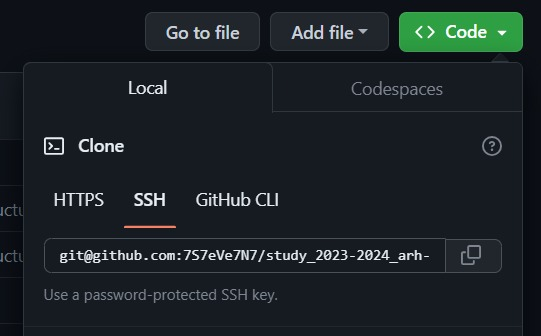

---
## Front matter
title: "Отчёт по лабораторной работе №2"
subtitle: "дисциплина: Архитектура компьютера"
author: "Машков Илья Евгеньевич"

## Generic otions
lang: ru-RU
toc-title: "Содержание"

## Bibliography
bibliography: bib/cite.bib
csl: pandoc/csl/gost-r-7-0-5-2008-numeric.csl

## Pdf output format
toc: true # Table of contents
toc-depth: 2
lof: true # List of figures
fontsize: 12pt
linestretch: 1.5
papersize: a4
documentclass: scrreprt
## I18n polyglossia
polyglossia-lang:
  name: russian
  options:
	- spelling=modern
	- babelshorthands=true
polyglossia-otherlangs:
  name: english
## I18n babel
babel-lang: russian
babel-otherlangs: english
## Fonts
mainfont: PT Serif
romanfont: PT Serif
sansfont: PT Sans
monofont: PT Mono
mainfontoptions: Ligatures=TeX
romanfontoptions: Ligatures=TeX
sansfontoptions: Ligatures=TeX,Scale=MatchLowercase
monofontoptions: Scale=MatchLowercase,Scale=0.9
## Biblatex
biblatex: true
biblio-style: "gost-numeric"
biblatexoptions:
  - parentracker=true
  - backend=biber
  - hyperref=auto
  - language=auto
  - autolang=other*
  - citestyle=gost-numeric
## Pandoc-crossref LaTeX customization
figureTitle: "Рис."
listingTitle: "Листинг"
tableTitle: "Таблица"
lofTitle: "Список иллюстраций"
lolTitle: "Листинги"
## Misc options
indent: true
header-includes:
  - \usepackage{indentfirst}
  - \usepackage{float} # keep figures where there are in the text
  - \floatplacement{figure}{H} # keep figures where there are in the text
---

# Цель работы

Целью работы является изучить идеологию и применение средств
контроля версий, а также приобрести практические навыки по работе с
системой git.

# Задание

1. Настройка github;
2. Базовая настройка git;
3. Создание SSH ключа;
4. Создание рабочего пространства и репозитория курса на основе шаблона;
5. Создание репозитория курса на основе шаблона;
6. Настройка каталога курса

# Выполнение лабораторной работы

## Настройка github

Так как у меня есть аккаунт на гитхабе и все основные данные заполнены (Рис. [-@fig:001]), я перехожу к следующему шагу лабораторной работы.

{#fig:001 width=70%}

## Базовая настройка git

Для начала я произвожу предварительную конфигурацию git, используя команду 'git config --global' и указываю имя и почту моего репозитория, затем настраиваю utf-8 в выводе сообщений git, задаю имя начальной ветки (master) и настраиваю параметры autocrlf и safecrlf (Рис. [-@fig:002]).

{#fig:002 width=70%}

## Создание SSH ключа

Для идентификации пользователя на сервере репозиториев необходимо сгенерировать два ключа: приватный и открытый. Для чего я буду
использовать команду 'ssh-keygen -C “Имя пользователя <email>”' (Рис. [-@fig:003]).

{#fig:003 width=70%}

Чтобы скопировать данный ключ я использую команду 'cat ~/.ssh/id_rsa.pub | xclip -sel clip' (Рис. [-@fig:004]).

{#fig:004 width=70%}

Далее захожу на гитхаб, перехожу в Settings, где и нахожу пункт “SSh and GPG keys”. Ввожу вставляю свой ключ в нужное поле, задаю название этого ключа и добавляю его (Рис. [-@fig:005]).

{#fig:005 width=70%}

## Создание рабочего пространства и репозитория курса на основе шаблона

Далее создаю рабочую папку “Архитектура компьютера” с помощью команды mkdir и проверяю её наличие командой ls (Рис. [-@fig:006]).

{#fig:006 width=70%}

## Создание репозитория курса на основе шаблона

Для создания репозитория курса нам необходимо перейти по ссылке https://github.com/yamadharma/course-directory-student-template и нажимаем на кнопку “Use this template” (Рис. [-@fig:007]).

{#fig:007 width=70%}

Создаём свой репозиторий и даём ему название (Рис. [-@fig:008]).

{#fig:008 width=70%}

Далее возвращаюсь в терминал, перехожу в рабочую папку “Архитектура компьютера” и клонирую репозиторий с помощью команды 'git clone –recursive «вставляю в это место ссылку на репозиторий» arch-pc' (Рис. [-@fig:009]), к сожалению этот момент я не запечатлел.

{#fig:009 width=70%}

## Настройка каталога курса

Далее перехожу в arch-pc, удаляю package.json и создаю необходимые папки (Рис. [-@fig:010]).

{#fig:010 width=70%}

Потом отправляю всё на сервер (Рис. [-@fig:011]).

{#fig:011 width=70%}

Затем перехожу на Github и проверяю правильность проделанных мной действий (Рис. [-@fig:012]).

{#fig:012 width=70%}

# Выполнение заданий для самостоятельной работы

 
1. Создаю отчёт по выполнению лабораторной в каталоге labs/lab02/report (Рис. [-@fig:013]). Создавать его я буду в LibreOffice Writer.

{#fig:013 width=70%}

2. Скачиваю отчёт по первой лабораторной с туиса и переношу его в папку labs/lab01/report из ~/Загрузки с помощью команды cp и проверяю правильность проделанных мной действий с помощью ls (Рис. [-@fig:014]).

{#fig:014 width=70%}

3. Загружаю первый отчёт с помощью команд 'git push НКА-04_Машков_отчёт.pdf' – добавление файла, 'git commit -am ‘add exiting files’' – чтобы сохранить изменения и 'git push' -- отправка на сервер (этого я тоже, к сожалению, не запечатлел) и проверяю страницу гита (Рис. [-@fig:015]).

{#fig:015 width=70%}

# Выводы

В ходе выполнения лабораторной работы я изучил применение средств контроля версий, а также получил опыт в работе с системой git.

# Список литературы{.unnumbered}

[Архитектура ЭВМ](https://esystem.rudn.ru/pluginfile.php/2089082/mod_resource/content/0/%D0%9B%D0%B0%D0%B1%D0%BE%D1%80%D0%B0%D1%82%D0%BE%D1%80%D0%BD%D0%B0%D1%8F%20%D1%80%D0%B0%D0%B1%D0%BE%D1%82%D0%B0%20%E2%84%962.%20%D0%A1%D0%B8%D1%81%D1%82%D0%B5%D0%BC%D0%B0%20%D0%BA%D0%BE%D0%BD%D1%82%D1%80%D0%BE%D0%BB%D1%8F%20%D0%B2%D0%B5%D1%80%D1%81%D0%B8%D0%B9%20Git.pdf)
[Репозиторий учителя](https://github.com/yamadharma/course-directory-student-template)
