---
## Front matter
title: "Отчёт по лабораторной работе №3"
subtitle: "Дисциплина: Архитектура компьютера"
author: "Машков Илья Евгеньевич"

## Generic otions
lang: ru-RU
toc-title: "Содержание"

## Bibliography
bibliography: bib/cite.bib
csl: pandoc/csl/gost-r-7-0-5-2008-numeric.csl

## Pdf output format
toc: true # Table of contents
toc-depth: 2
lof: true # List of figures
fontsize: 12pt
linestretch: 1.5
papersize: a4
documentclass: scrreprt
## I18n polyglossia
polyglossia-lang:
  name: russian
  options:
	- spelling=modern
	- babelshorthands=true
polyglossia-otherlangs:
  name: english
## I18n babel
babel-lang: russian
babel-otherlangs: english
## Fonts
mainfont: PT Serif
romanfont: PT Serif
sansfont: PT Sans
monofont: PT Mono
mainfontoptions: Ligatures=TeX
romanfontoptions: Ligatures=TeX
sansfontoptions: Ligatures=TeX,Scale=MatchLowercase
monofontoptions: Scale=MatchLowercase,Scale=0.9
## Biblatex
biblatex: true
biblio-style: "gost-numeric"
biblatexoptions:
  - parentracker=true
  - backend=biber
  - hyperref=auto
  - language=auto
  - autolang=other*
  - citestyle=gost-numeric
## Pandoc-crossref LaTeX customization
figureTitle: "Рис."
tableTitle: "Таблица"
listingTitle: "Листинг"
lofTitle: "Список иллюстраций"
lotTitle: "Список таблиц"
lolTitle: "Листинги"
## Misc options
indent: true
header-includes:
  - \usepackage{indentfirst}
  - \usepackage{float} # keep figures where there are in the text
  - \floatplacement{figure}{H} # keep figures where there are in the text
---

# Цель работы

Целью работы является освоение процедуры оформления отчетов с помощью легковесного языка разметки Markdown.

# Задание

1. Заполнение отчета по выполнению лабораторной работы №3 с помощью языка разметки Markdown;
2. Задание для самостоятельной работы.

# Выполнение лабораторной работы

## Заполнение отчёта по выполнению лабораторной работы №3 с помощью языка разметки Markdown.

Для начала открываю терминал и перехожу в папку arch-pc и обновляю её с помощью команды "git pull"(рис. [-@fig:001]).

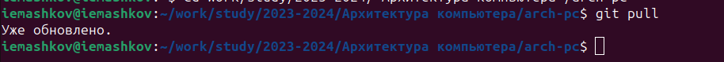{#fig:001 width=70%}

Далее перехожу в папку labs/lab02/report, просматриваю её содержимое и с помощью команды "make" произвожу компиляцию шаблона, далее ввожу команду "ls", чтобы проверить скомпилировались ли файлы report.pdf и report.docx (Рис. [-@fig:002]).

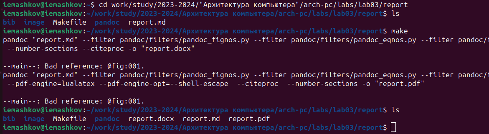{#fig:002 width=70%}

Затем открываю оба этих файла, чтобы проверить их содержимое (Рис. [-@fig:003]).

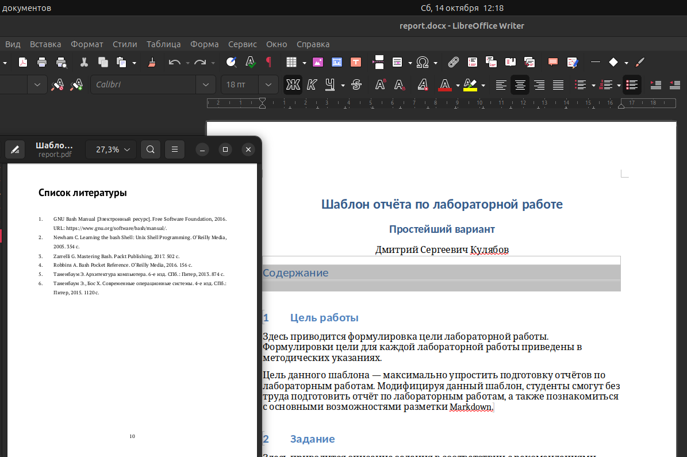{#fig:003 width=70%}

Теперь прописываю команду "make clean", чтобы удалить эти файлы, и проверяю папку с помощью команды "ls" (Рис. [-@fig:004]).

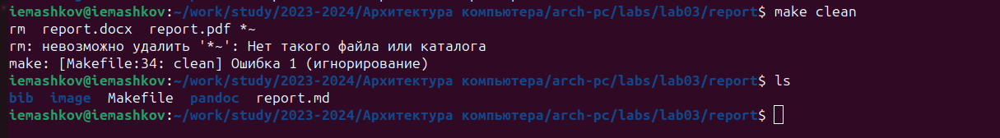{#fig:004 width=70%}

Открываю report.md изучаю его структуру и начинаю заполнять отчёт (Рис. [-@fig:005]).

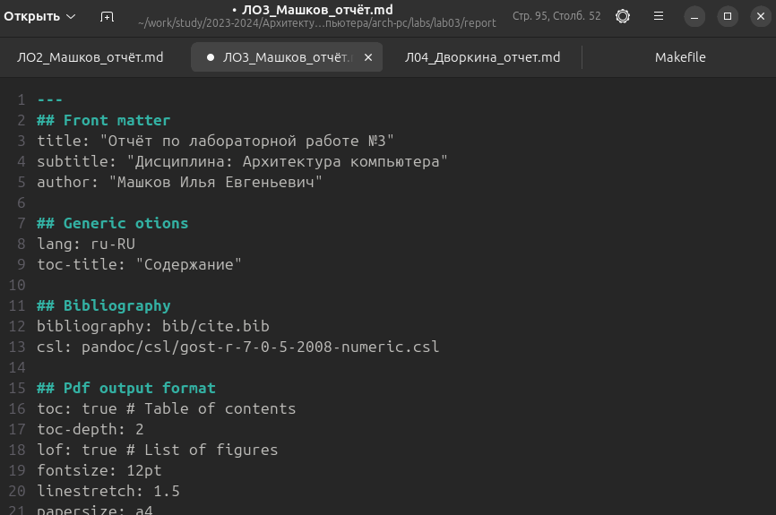{#fig:005 width=70%}

Потом компилирую отчёт и загружаю файлы на сервер.

## Выполнение заданий для самостоятельной работы

1. Перехожу в директорию lab02/report, компилирую шаблон, копирую его с новым именем и прописываю команду "make clean", чтобы удалить ненужные файлы (Рис. [-@fig:006]).

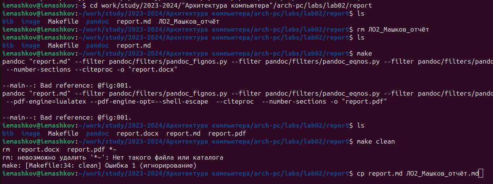{#fig:006 width=70%}

Затем начинаю заполнять отчёт (Рис. [-@fig:007]).

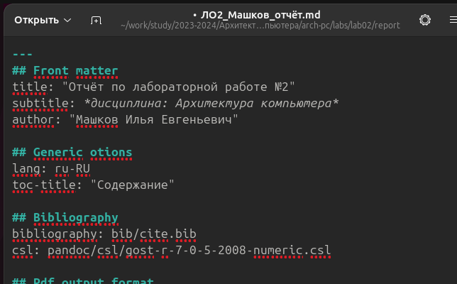{#fig:007 width=70%}

Теперь компилирую файлы с отчётом (Рис. [-@fig:008]).

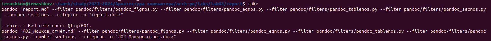{#fig:008 width=70%}

Проверяю правильность проделанных мной действий (Рис. [-@fig:009]).

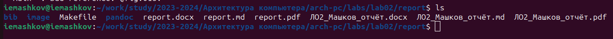{#fig:009 width=70%}

И удаляю ненужные файлы (Рис. [-@fig:010]).

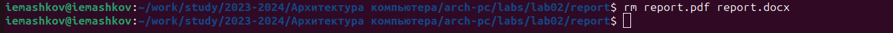{#fig:010 width=70%}

2. Используя команду "git add .", я добавляю изменения, командой "git commit -m 'Add report files'" сохраняю их (Рис. [-@fig:011]).

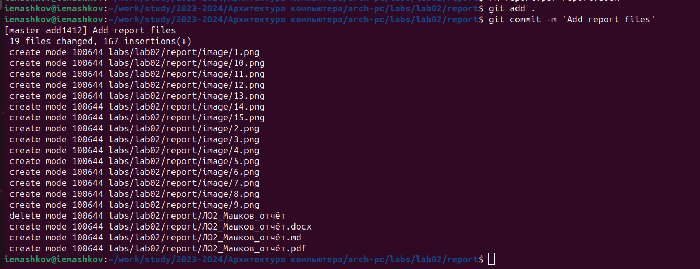{#fig:011 width=70%}

Теперь отправляю файлы на сервер с помощью команды "git push" (Рис. [-@fig:012]).

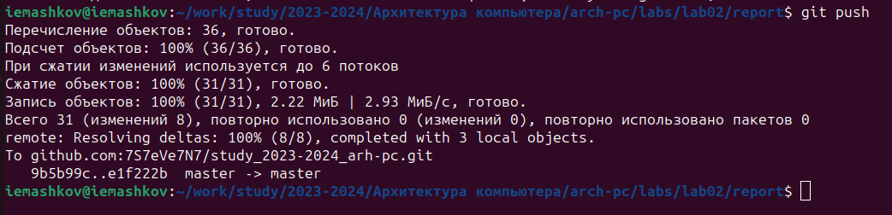{#fig:012 width=70%}

# Выводы

В результате выполнения данной лабораторной работы я освоил процедуры оформления отчетов с помощью легковесного языка разметки Markdown.

# Список литературы{.unnumbered}

[Архитектура ЭВМ](https://esystem.rudn.ru/pluginfile.php/2089083/mod_resource/content/0/%D0%9B%D0%B0%D0%B1%D0%BE%D1%80%D0%B0%D1%82%D0%BE%D1%80%D0%BD%D0%B0%D1%8F%20%D1%80%D0%B0%D0%B1%D0%BE%D1%82%D0%B0%20%E2%84%963.%20%D0%AF%D0%B7%D1%8B%D0%BA%20%D1%80%D0%B0%D0%B7%D0%BC%D0%B5%D1%82%D0%BA%D0%B8%20.pdf)
