---
## Front matter
title: "Отчёт по лабораторной работе №4"
subtitle: "Дисциплина: Архитектура компьютера"
author: "Машков Илья Евгеньевич"

## Generic otions
lang: ru-RU
toc-title: "Содержание"

## Bibliography
bibliography: bib/cite.bib
csl: pandoc/csl/gost-r-7-0-5-2008-numeric.csl

## Pdf output format
toc: true # Table of contents
toc-depth: 2
lof: true # List of figures
fontsize: 12pt
linestretch: 1.5
papersize: a4
documentclass: scrreprt
## I18n polyglossia
polyglossia-lang:
  name: russian
  options:
	- spelling=modern
	- babelshorthands=true
polyglossia-otherlangs:
  name: english
## I18n babel
babel-lang: russian
babel-otherlangs: english
## Fonts
mainfont: PT Serif
romanfont: PT Serif
sansfont: PT Sans
monofont: PT Mono
mainfontoptions: Ligatures=TeX
romanfontoptions: Ligatures=TeX
sansfontoptions: Ligatures=TeX,Scale=MatchLowercase
monofontoptions: Scale=MatchLowercase,Scale=0.9
## Biblatex
biblatex: true
biblio-style: "gost-numeric"
biblatexoptions:
  - parentracker=true
  - backend=biber
  - hyperref=auto
  - language=auto
  - autolang=other*
  - citestyle=gost-numeric
## Pandoc-crossref LaTeX customization
figureTitle: "Рис."
tableTitle: "Таблица"
listingTitle: "Листинг"
lofTitle: "Список иллюстраций"
lotTitle: "Список таблиц"
lolTitle: "Листинги"
## Misc options
indent: true
header-includes:
  - \usepackage{indentfirst}
  - \usepackage{float} # keep figures where there are in the text
  - \floatplacement{figure}{H} # keep figures where there are in the text
---

# Цель работы

Освоение процедуры компиляции и сборки программ, написанных на ассемблере NASM.

# Задание

1. Программа Hello world!;
2. Транслятор NASM;
3. Расширенный синтаксис командной строки NASM;
4. Компоновщик LD;
5. Запуск исполняемого файла;
6. Выполнение заданий для самостоятельной работы.

# Выполнение лабораторной работы

## Программа Hello world!

Создаю папку lab4 в директории arch-pc и создаю файл hello.asm с помощью команды "touch" (рис. [-@fig:001]).

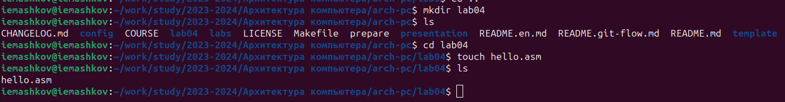{#fig:001 width=70%}

Далее открываю файл, копирую в него пример программы из лабораторной работы на ТУИСе и внимательно изучаю её структуру (Рис. [-@fig:002]).

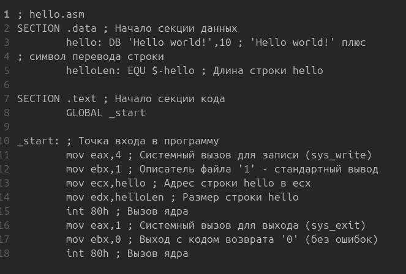{#fig:002 width=70%}

## Транслятор NASM

Чтобы скомпилировать текст из программы "Hello world!" в файл hello.o, использую команду "nasm -f elf hello.asm" и проверяю правильность проделанных действий с помощью команды "ls" (Рис. [-@fig:003]).

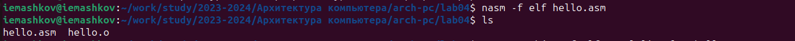{#fig:003 width=70%}

## Расширенный синтаксис командной строки NASM

Чтобы скомпилировать исходный файл hello.asm в файл obj.o и в листинг list.lst, использую команду "nasm -o obj.o -f elf -g -l list.lst hello.asm" и проверяю правильность проделанных действий с помощью команды "ls" (Рис. [-@fig:004]).

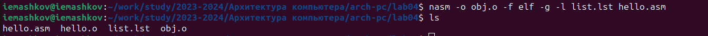{#fig:004 width=70%}

## Компоновщик LD

Далее мне нужно получить исполняемую программу и объектный файл, чтобы это сделать мне необходимо передать файлы hello.o и obj.o, для чего я буду использовать команды "ld -m elf_i386 hello.o -o hello" и "ld -m elf_i386 obj.o -o main" соответственно (ключ -о используется для объектных файлов) (Рис. [-@fig:005]).

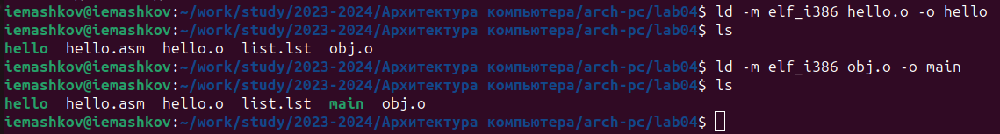{#fig:005 width=70%}

## Запуск исполняемого файла

Теперь я запускаю испрлняемый файл с помощью команды "./hello", если всё было сделано правильно, то программа выведет надпись "Hello world!" (Рис. [-@fig:006]).

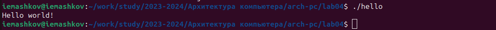{#fig:006 width=70%}

## Выполнение заданий для самостоятельной работы

1. Находясь в этом же каталоге, создаю копию файла hello.asm с именем lab4.asm с помощью команды "cp" (Рис. [-@fig:007]).

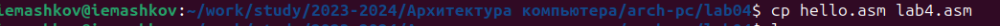{#fig:007 width=70%}

2. Теперь открываю lab4.asm в текстовом редакторе, заменяю выводимую фразу на свои имя и фамилию, а также везде заменяю слово "hello", т.к. имя файла теперь lab4 (Рис. [-@fig:008]).

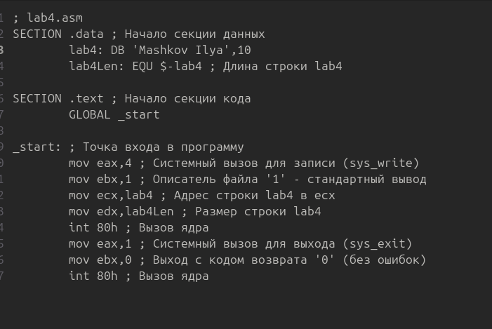{#fig:008 width=70%}

3. Затем транслирую текст файла в объектный файл (Рис. [-@fig:009]).

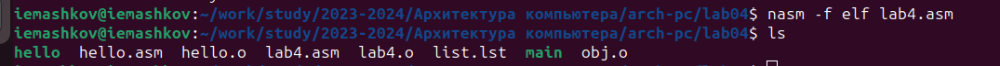{#fig:009 width=70%}

Далее компоную и запускаю программу (Рис. [-@fig:010]).

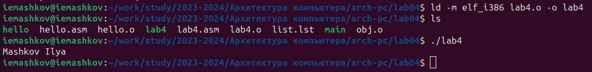{#fig:010 width=70%}

4. Теперь копирую файлы "hello.asm" и "lab4.asm" в папку labs/lab04 (Рис. [-@fig:011]).

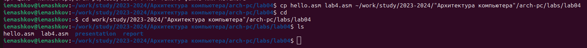{#fig:011 width=70%}

После чего отправляю файлы на сервер (Рис. [-@fig:011]).

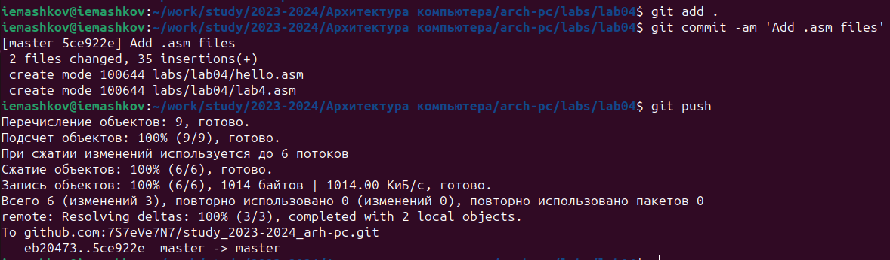{#fig:011 width=70%}

# Выводы

При выполнении данной лабораторной работы я освоил процедуры компиляции и сборки программ, написанных на ассемблере NASM.

# Список литературы

[Архитектура ЭВМ](https://esystem.rudn.ru/pluginfile.php/2089083/mod_resource/content/0/%D0%9B%D0%B0%D0%B1%D0%BE%D1%80%D0%B0%D1%82%D0%BE%D1%80%D0%BD%D0%B0%D1%8F%20%D1%80%D0%B0%D0%B1%D0%BE%D1%82%D0%B0%20%E2%84%963.%20%D0%AF%D0%B7%D1%8B%D0%BA%20%D1%80%D0%B0%D0%B7%D0%BC%D0%B5%D1%82%D0%BA%D0%B8%20.pdf)
