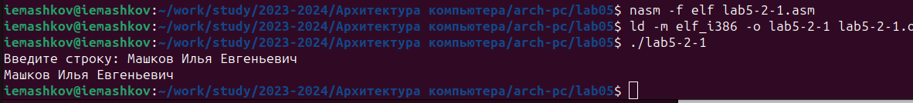

---
## Front matter
title: "Отчёт по лабораторной работе №5"
subtitle: "Дисциплина: Архитектура компьютера"
author: "Машков Илья Евгеньевич"

## Generic otions
lang: ru-RU
toc-title: "Содержание"

## Bibliography
bibliography: bib/cite.bib
csl: pandoc/csl/gost-r-7-0-5-2008-numeric.csl

## Pdf output format
toc: true # Table of contents
toc-depth: 2
lof: true # List of figures
fontsize: 12pt
linestretch: 1.5
papersize: a4
documentclass: scrreprt
## I18n polyglossia
polyglossia-lang:
  name: russian
  options:
	- spelling=modern
	- babelshorthands=true
polyglossia-otherlangs:
  name: english
## I18n babel
babel-lang: russian
babel-otherlangs: english
## Fonts
mainfont: PT Serif
romanfont: PT Serif
sansfont: PT Sans
monofont: PT Mono
mainfontoptions: Ligatures=TeX
romanfontoptions: Ligatures=TeX
sansfontoptions: Ligatures=TeX,Scale=MatchLowercase
monofontoptions: Scale=MatchLowercase,Scale=0.9
## Biblatex
biblatex: true
biblio-style: "gost-numeric"
biblatexoptions:
  - parentracker=true
  - backend=biber
  - hyperref=auto
  - language=auto
  - autolang=other*
  - citestyle=gost-numeric
## Pandoc-crossref LaTeX customization
figureTitle: "Рис."
tableTitle: "Таблица"
listingTitle: "Листинг"
lofTitle: "Список иллюстраций"
lolTitle: "Листинги"
## Misc options
indent: true
header-includes:
  - \usepackage{indentfirst}
  - \usepackage{float} # keep figures where there are in the text
  - \floatplacement{figure}{H} # keep figures where there are in the text
---

# Цель работы

Приобретение практических навыков работы в Midnight Commander. Освоение инструкций
языка ассемблера mov и int.

# Задание

1. Основы работы с mc
2. Структура программы на языке ассемблера NASM
3. Подключение внешнего файла
4. Выполнение заданий для самостоятельной работы

# Выполнение лабораторной работы

## Основы работы с mc

Открываю Midnight Commander с помощью команды mc (рис. [-@fig:001]).

{#fig:001 width=70%}

Потом перехожу в рабочий каталог, используя mc, и создаю каталог lab05. Создать каталог можно, как через терминал (именно так я его и создал), так и с помощью кнопки F7 (Рис. [-@fig:002]).

{#fig:002 width=70%}

Далее перехожу в созданный каталог и с помощью команды 'touch' создаю файл lab5-1.asm (Рис. [-@fig:003]).

{#fig:003 width=70%}

## Структура программы на языке ассемблера NASM

Открываю файл с помощью клавиши F4 и ввожу код программы для запроса строки у пользователя, сохраняю изменения с помощью комбинации (Ctrl+O) (Рис. [-@fig:004]). 

{#fig:004 width=70%}

А затем просматриваю содержимое файла с помощью клавиши F3 (Рис. [-@fig:005]).

{#fig:005 width=70%}

Далее транслирую текст программы в объектный файл, компаную полученный файл и запускаю исполняемый файл (Рис. [-@fig:006]).

{#fig:006 width=70%}

## Подключение внешнего файла

Скачиваю файл in_out.asm со страницы курса на ТУИС. Так как он сохранился в папке "Загрузки", я с помощью клавиши F5 переношу его в каталог lab05 (Рис. [-@fig:007]).

{#fig:007 width=70%}

Затем с помощью всё той же клавиши F5 копирую содержимое файла lab5-1.asm в файл lab5-2.asm (Рис. [-@fig:008]).

{#fig:008 width=70%}

Этим действием я создал новый файл с содержимым старого (Рис. [-@fig:009]).

{#fig:009 width=70%}

Теперь изменяю содержимое этого файла так, чтобы в программе изпользовались подпрограммы из внешнего файла in_out.asm (Рис. [-@fig:010]).

{#fig:010 width=70%}

После этого я транслирую, компоную и запускаю программу сначало с параметром 'sprintLF' (Рис. [-@fig:011]).

{#fig:011 width=70%}

А потом меняю этот параметр на 'sprint' и произвожу те же действия (Рис. [-@fig:012]).

{#fig:012 width=70%}

Разница состоит в том, что с параметром 'sprintLF' пользователь вводит свой текст с новой строки, а со 'sprint' ввод происходит на той же строке, где написано "Введите строку:".

## Выполнение заданий для самостоятельной работы

1. Создаю копию файла lab5-1.asm, используя клавишу F5. Затем изменяю код программы так, чтобы после вывода запроса о введении строки она также выводила и вводимую пользователем строку (Рис. [-@fig:013]).

{#fig:013 width=70%}

2. Теперь получаю исполняемый файл и запускаю его (Рис. [-@fig:014]).

{#fig:014 width=70%}

3. Создаю копию файла lab5-2.asm и также меняю код программы, чтобы он выводил вводимую строку (Рис. [-@fig:015]).

{#fig:015 width=70%}

4. Получаю исполняемый файл и проверяю корректность его работы (Рис. [-@fig:016]).

{#fig:016 width=70%}

# Выводы

В ходе выпонения лабораторной работы я приобрел практические навыки работы в Midnight Commander, а также освоил инструкции языка ассемблера mov и int.

# Список литературы

[Архитектура ЭВМ](https://esystem.rudn.ru/pluginfile.php/2089085/mod_resource/content/0/%D0%9B%D0%B0%D0%B1%D0%BE%D1%80%D0%B0%D1%82%D0%BE%D1%80%D0%BD%D0%B0%D1%8F%20%D1%80%D0%B0%D0%B1%D0%BE%D1%82%D0%B0%20%E2%84%965.%20%D0%9E%D1%81%D0%BD%D0%BE%D0%B2%D1%8B%20%D1%80%D0%B0%D0%B1%D0%BE%D1%82%D1%8B%20%D1%81%20Midnight%20Commander%20%28%29.%20%D0%A1%D1%82%D1%80%D1%83%D0%BA%D1%82%D1%83%D1%80%D0%B0%20%D0%BF%D1%80%D0%BE%D0%B3%D1%80%D0%B0%D0%BC%D0%BC%D1%8B%20%D0%BD%D0%B0%20%D1%8F%D0%B7%D1%8B%D0%BA%D0%B5%20%D0%B0%D1%81%D1%81%D0%B5%D0%BC%D0%B1%D0%BB%D0%B5%D1%80%D0%B0%20NASM.%20%D0%A1%D0%B8%D1%81%D1%82%D0%B5%D0%BC%D0%BD%D1%8B%D0%B5%20%D0%B2%D1%8B%D0%B7%D0%BE%D0%B2%D1%8B%20%D0%B2%20%D0%9E%D0%A1%20GNU%20Linux.pdf)
