---
## Front matter
title: "Отчёт по лабораторной работе №6"
subtitle: "Дисциплина: Архитектура компьютера"
author: "Машков Илья Евгеньевич"

## Generic otions
lang: ru-RU
toc-title: "Содержание"

## Bibliography
bibliography: bib/cite.bib
csl: pandoc/csl/gost-r-7-0-5-2008-numeric.csl

## Pdf output format
toc: true # Table of contents
toc-depth: 2
lof: true # List of figures
fontsize: 12pt
linestretch: 1.5
papersize: a4
documentclass: scrreprt
## I18n polyglossia
polyglossia-lang:
  name: russian
  options:
	- spelling=modern
	- babelshorthands=true
polyglossia-otherlangs:
  name: english
## I18n babel
babel-lang: russian
babel-otherlangs: english
## Fonts
mainfont: PT Serif
romanfont: PT Serif
sansfont: PT Sans
monofont: PT Mono
mainfontoptions: Ligatures=TeX
romanfontoptions: Ligatures=TeX
sansfontoptions: Ligatures=TeX,Scale=MatchLowercase
monofontoptions: Scale=MatchLowercase,Scale=0.9
## Biblatex
biblatex: true
biblio-style: "gost-numeric"
biblatexoptions:
  - parentracker=true
  - backend=biber
  - hyperref=auto
  - language=auto
  - autolang=other*
  - citestyle=gost-numeric
## Pandoc-crossref LaTeX customization
figureTitle: "Рис."
tableTitle: "Таблица"
listingTitle: "Листинг"
lofTitle: "Список иллюстраций"
lolTitle: "Листинги"
## Misc options
indent: true
header-includes:
  - \usepackage{indentfirst}
  - \usepackage{float} # keep figures where there are in the text
  - \floatplacement{figure}{H} # keep figures where there are in the text
---

# Цель работы

Цель данной лабораторной работы - освоение арифметческих инструкций языка ассемблера NASM.

# Задание

1. Символьные и численные данные в NASM
2. Выполнение арифметических операций в NASM
3. Выполнение заданий для самостоятельной работы

# Выполнение лабораторной работы

## Символьные и численные данные в NASM

Ещё в прошлой лабораторной работе я по ошибке создал папку **lab06** (рис. [-@fig:001]).

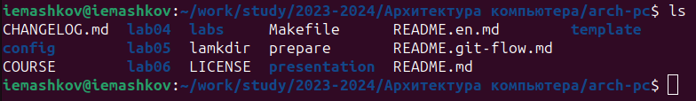{#fig:001 width=70%}

Далее я перехожу в эту директорию и создаю файл **lab6-1.asm** с помощью команды **'touch'** (Рис. [-@fig:002]).

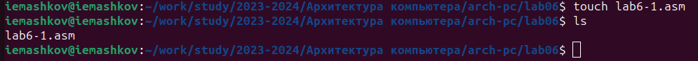{#fig:002 width=70%}

Затем я ввожу код в .asm файл (Рис. [-@fig:003]).

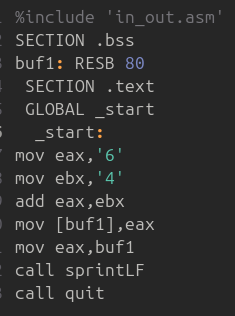{#fig:003 width=70%}

Создаю исполняемый файл и запускаю программу (Рис. [-@fig:004]). В выводе программы я получаю символ **'j'**, который по системе ASCII соответствует сумме двоичных кодов символов **6** и **4**.

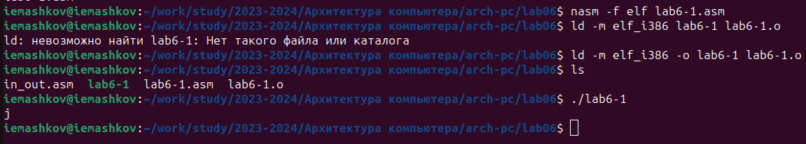{#fig:004 width=70%}

Теперь я убираю кавычки у символов **6** и **4**, создаю исполняемый файл и запускаю программу (Рис. [-@fig:005]). В выводе я получаю неотображающийся символ с кодом **10** - это **символ перевода строки**.

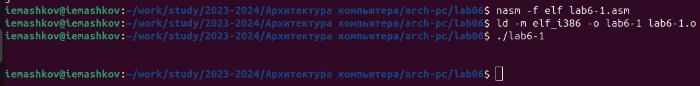{#fig:005 width=70%}

Создаю файл **lab6-2.asm** (Рис. [-@fig:006]).

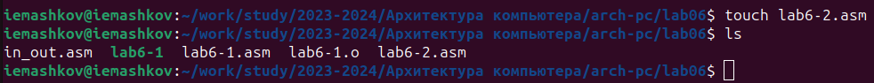{#fig:006 width=70%}

Ввожу код программы (Рис. [-@fig:007]).

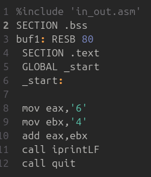{#fig:006 width=70%}

Создаю исполняемый файл и запускаю программу (Рис. [-@fig:008]). В выводе получаю число **106**, т.к. программа позволяет вывести число, а не символ, хоть и по-прежнему происходит сложение кодов символов **6** и **4**.

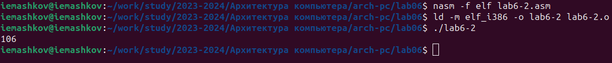{#fig:008 width=70%}

Теперь убираю кавычки и заново создаю исполняемый файл и запускаю программу и в выводе получаю **10**, т.к. в этом случае программа складывает сами числа, а не их коды (Рис. [-@fig:009]).

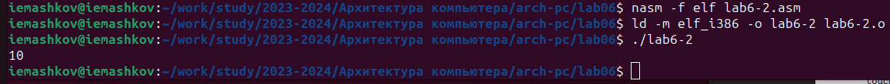{#fig:008 width=70%}

Затем меняю параметр **'iprintLF'** на **'iprint'**, создаю исполняемый файл и запускаю программу (Рис. [-@fig:010]). В выводе получаю то же число, но без символа переноса строки.

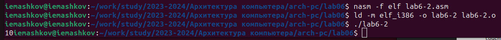{#fig:010 width=70%}

## Выполнение арифметических операций в NASM

Создаю файл **lab6-3.asm** (при создании я забыл дать ему расширение .asm, но потом переименовал его) (Рис. [-@fig:011]). 

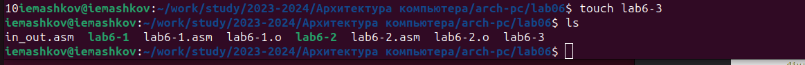{#fig:011 width=70%}

Теперь ввожу в него код программы, который будет вычислять выражение f(x) = (5*2 + 3)/3 (Рис. [-@fig:012]).

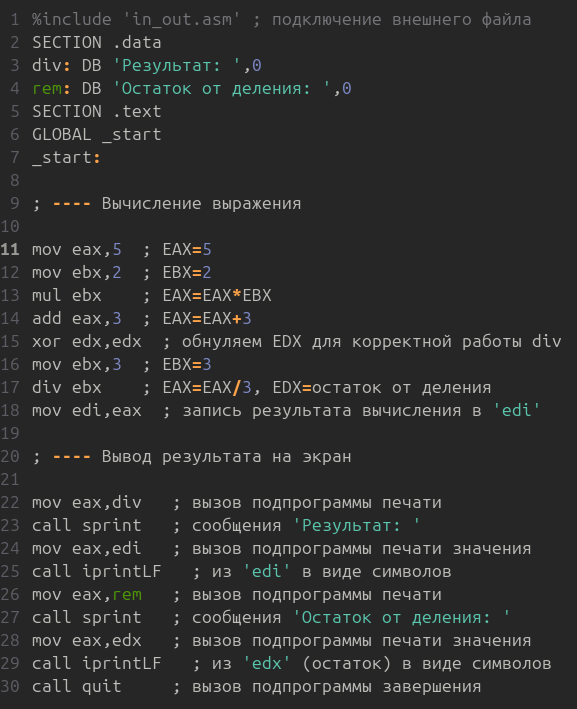{#fig:012 width=70%}

Далее создаю исполняемый файл и запускаю программу (Рис. [-@fig:013]).

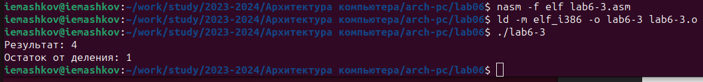{#fig:013 width=70%}

Изменяю код программы так, чтобы она вычисляла выражение f(x) = (4*6 + 2)/5 (Рис. [-@fig:014]).

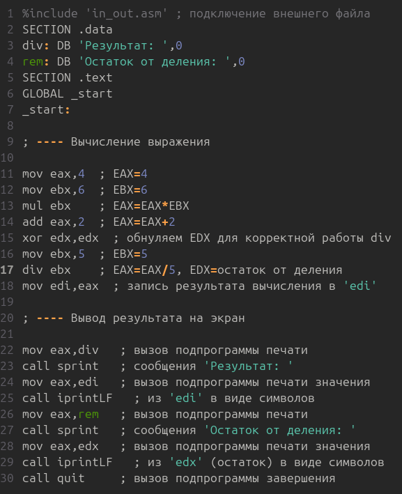{#fig:014 width=70%}

Создаю исполняемый файл и запускаю программу (Рис. [-@fig:015]).

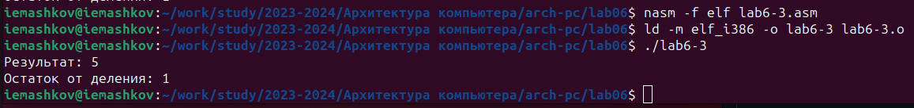{#fig:015 width=70%}

Создаю файл **variant.asm** с помощью команды **'touch'** (Рис. [-@fig:016]).

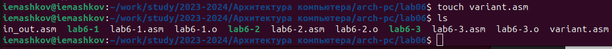{#fig:016 width=70%}

Теперь ввожу в него код программы, которая по номеру студенческого должна мне выдать номер моего варианта (Рис. [-@fig:017]).

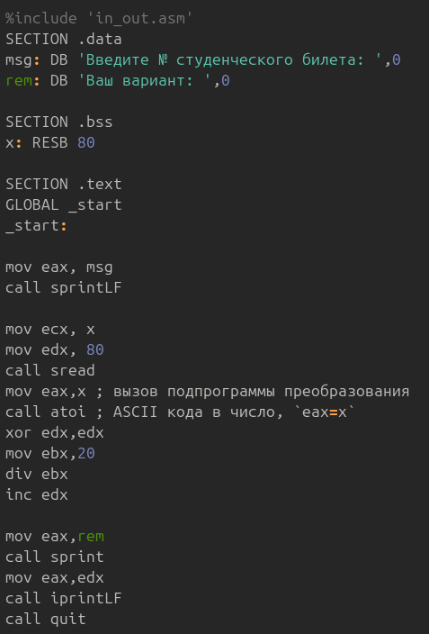{#fig:017 width=70%}

Создаю исполняемый файл и запускаю его (Рис. [-@fig:018]). Мой вариант - **5**.

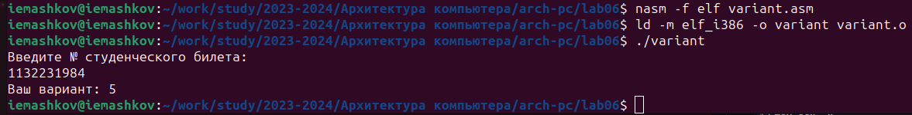{#fig:018 width=70%}

# Ответы на вопросы по программе

1. За вывод сообщения **"Ваш вариант: "** отвечают эти строки кода (Рис. [-@fig:019]):

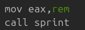{#fig:018 width=70%}

2. **'mov ecx, x'** используется для того, чтобы внести адрес вводимой строки **'x'** в регистр **'ecx'**. **'mov edx, 80'** - запись в регистр **'edx'** длинны вводимой строки. **'call sread'** - вызов подпрограммы из внешнего файла, которая обеспечивает ввод сообщения с клавиатуры.

3. **'call atoi'** - подпрограмма из внешнего файла, преобразующая код символа в целое число и записывающая его в регистр **'eax'**.

4. За вычисление варианта отвечают строки (Рис. [-@fig:020]):

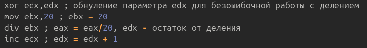{#fig:020 width=70%}

5. При выполнении инструкции **'div ebx'** остаток от деления записывается в регистр **'edx'**.

6. Инструкция **'inc edx'** увеличивает значение регистра **'edx'** на **1**

7. За вывод на экран результатов вычислений отвечают строки (Рис. [-@fig:021]):

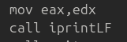{#fig:021 width=70%}

## Выполнение заданий для самостоятельной работы

1. Создаю файл **lab6-4.asm** (Рис. [-@fig:022]).

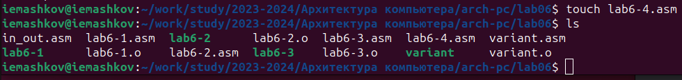{#fig:022 width=70%}

Ввожу код программы, которая будет вычислять выражение **'f(x) = (9x - 8)/8'**. Именно это выражение стоит под номером **5** в таблице (Рис. [-@fig:023]).

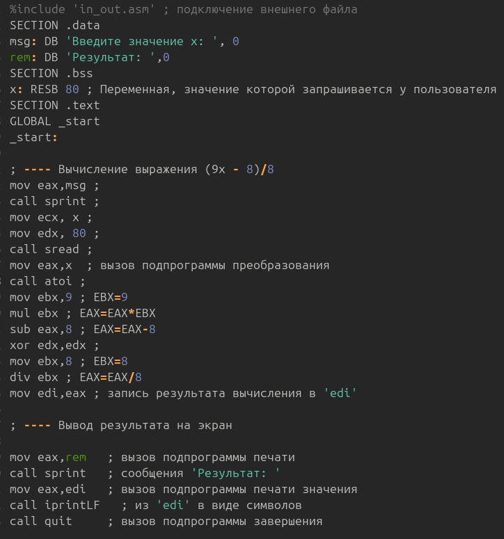{#fig:023 width=70%}

Создаю исполняемый файл и запускаю его со значением **'8'**, а потом и со значением **'64'** (Рис. [-@fig:024]).

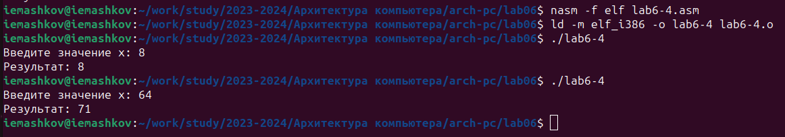{#fig:024 width=70%}

Эти результаты я проверил, а это значит, что программа отработала верно.
# Выводы

При выполнении данной лабораторной работы я освоил арифметические инструкции языка ассемблера NASM.

# Список литературы

[Архитектура ЭВМ](https://esystem.rudn.ru/pluginfile.php/2089086/mod_resource/content/0/%D0%9B%D0%B0%D0%B1%D0%BE%D1%80%D0%B0%D1%82%D0%BE%D1%80%D0%BD%D0%B0%D1%8F%20%D1%80%D0%B0%D0%B1%D0%BE%D1%82%D0%B0%20%E2%84%966.%20%D0%90%D1%80%D0%B8%D1%84%D0%BC%D0%B5%D1%82%D0%B8%D1%87%D0%B5%D1%81%D0%BA%D0%B8%D0%B5%20%D0%BE%D0%BF%D0%B5%D1%80%D0%B0%D1%86%D0%B8%D0%B8%20%D0%B2%20NASM..pdf)

[Таблица кодов ASCII](https://www.rapidtables.com/code/text/ascii-table.html)
