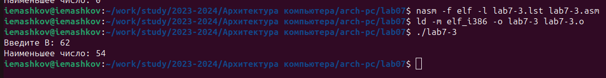

---
## Front matter
title: "Отчёт по лабораторной работе №7"
subtitle: "Дисциплина: Архитектура компьютера"
author: "Машков Илья Евгеньевич"

## Generic otions
lang: ru-RU
toc-title: "Содержание"

## Bibliography
bibliography: bib/cite.bib
csl: pandoc/csl/gost-r-7-0-5-2008-numeric.csl

## Pdf output format
toc: true # Table of contents
toc-depth: 2
lof: true # List of figures
fontsize: 12pt
linestretch: 1.5
papersize: a4
documentclass: scrreprt
## I18n polyglossia
polyglossia-lang:
  name: russian
  options:
	- spelling=modern
	- babelshorthands=true
polyglossia-otherlangs:
  name: english
## I18n babel
babel-lang: russian
babel-otherlangs: english
## Fonts
mainfont: PT Serif
romanfont: PT Serif
sansfont: PT Sans
monofont: PT Mono
mainfontoptions: Ligatures=TeX
romanfontoptions: Ligatures=TeX
sansfontoptions: Ligatures=TeX,Scale=MatchLowercase
monofontoptions: Scale=MatchLowercase,Scale=0.9
## Biblatex
biblatex: true
biblio-style: "gost-numeric"
biblatexoptions:
  - parentracker=true
  - backend=biber
  - hyperref=auto
  - language=auto
  - autolang=other*
  - citestyle=gost-numeric
## Pandoc-crossref LaTeX customization
figureTitle: "Рис."
tableTitle: "Таблица"
listingTitle: "Листинг"
lofTitle: "Список иллюстраций"
lolTitle: "Листинги"
## Misc options
indent: true
header-includes:
  - \usepackage{indentfirst}
  - \usepackage{float} # keep figures where there are in the text
  - \floatplacement{figure}{H} # keep figures where there are in the text
---

# Цель работы

Изучение команд условного и безусловного переходов. Приобретение навыков написания программ с использованием переходов. Знакомство с назначением и структурой файла листинга.

# Задание

1. Реализация переходов в NASM
2. Изучение структуры файла листинга
3. Выполнение заданий для самостоятельной работы

# Выполнение лабораторной работы

## Реализация переходов в NASM

Для начала в папке локального репозитория я создаю директорию **lab07** для дальнейшей работы в ней (рис. [-@fig:001]).

{#fig:001 width=70%}

Далее я перехожу в эту директорию и создаю файл **lab7-1.asm** с помощью команды **'touch'**, а также копирую файл **in_out.asm** (Рис. [-@fig:002]).

{#fig:002 width=70%}

Затем я ввожу код в .asm файл (Рис. [-@fig:003]).

{#fig:003 width=70%}

Создаю исполняемый файл и запускаю программу (Рис. [-@fig:004]). В выводе программы я получаю символ **'Сообщение №2'** и **'Сообщение №3'**.

{#fig:004 width=70%}

Теперь я меняю в программе пару строк, чтобы получился такой вывод: **'Сообщение №3'**, **'Сообщение №2'**, **'Сообщение №1'**. (Рис. [-@fig:005]).

{#fig:005 width=70%}

Создаю исполняемый файл и запускаю его (Рис. [-@fig:006]). В выводе получаю именно то, что мне и надо было.

{#fig:006 width=70%}

Создаю файл **lab7-2.asm** (Рис. [-@fig:007]).

{#fig:007 width=70%}

Ввожу код программы (Рис. [-@fig:008]).

{#fig:008 width=70%}

Создаю исполняемый файл и запускаю программу (Рис. [-@fig:009]). В выводе получаю число **50**, т.к. это и есть максимальное из всех значений, но если в **'B'** ввести число, которое будет больше 50-ти, то программа выведет введённое с клавиатуры число.

{#fig:009 width=70%}

## Изучение структуры файла листинга
С помощью команды **'nasm -f elf -l lab7-2.lst lab7-2.asm'** создаю файл листинга, внимательно изучаю его структуру. После чего я выбрал три строчки к которым буду писать пояснение (Рис. [-@fig:010]). 

{#fig:010 width=70%}

1. Командой **'mov ecx,[max]'** мы перемещаем в регистр **ecx** значения из **max**, где лежат результаты сравнения **А** и **С**.
2. Комманда **'cmp ecx,[B]'** похволяет нам провести сравнение **В** со значениями **А** и **С**.
3. Если **'max(A, C) > B'** то команда **'jg'** позволяет нам перейти на финальный этап программы, обозначенный меткой **'fin'**. Команда **'jg'** позволяет перейти к следующей метке только если мы получаем такое сравнение: **'A > B'** - иначе будет использоваться **'jl'**, **'jle'**, **'jge'** и т.д..

Далее по заданию мне нужно было убрать из любой инструкции с двумя операндами один операнд и выполнить трансляцию с получением файла листинга. Я сделал это в разных местах, но при трансляции вылетала ошибка, а изменённый файл листинга не создавался, т.к. программа не может работать при отсутствии одного операнда. (Рис. [-@fig:011]).

{#fig:011 width=70%}

## Выполнение заданий для самостоятельной работы

1. Создаю файл **lab7-3.asm** и ввожу код программы, которая будет находить минимальное из значений **А**, **В** и **С**. Для этого я немного поменял код программы **'lab7-2.asm'** (Рис. [-@fig:012]).

{#fig:012 width=70%}

Создаю исполняемый файл и запускаю его со значениями из 5-го варианта: **'54'**, **'62'**, **'87'** (Рис. [-@fig:013]).

{#fig:013 width=70%}

**P.s.**: Изначально я запумкал вариант программы, где значение **В** запрашивалось с клавиатуры, но, как видно из (Рис. [-@fig:012]), я поменял программу так, чтобы ничего с клавиатуры не запрашивалось и в выводе получал число **'54'**, что и является правильным ответом.

2. Создаю файл **lab7-4.asm** (Рис. [-@fig:014]).

{#fig:014 width=70%}

Ввожу код программы, которая будет запрашивать значения **x** и **a** с клавиатуры и после сравнения их значений вычислять значения функции, которые указаны напротив результатов сравнения в варианте **5** (Рис. [-@fig:015]).

{#fig:015 width=70%}

Далее создаю исполняемый файл и запускаю программу в первый раз со значениями **(1;2)**, а потом и с **(2;1)** (Рис. [-@fig:016])

{#fig:015 width=70%}

Результаты я проверил, пожтому могу сказать, что программа отработала верно.

# Выводы

При выполнении данной лабораторной работы я освоил переходы в NASM, а также научился создавать и разбираться в файле листинга.

# Список литературы

[Архитектура ЭВМ](https://esystem.rudn.ru/pluginfile.php/2089087/mod_resource/content/0/%D0%9B%D0%B0%D0%B1%D0%BE%D1%80%D0%B0%D1%82%D0%BE%D1%80%D0%BD%D0%B0%D1%8F%20%D1%80%D0%B0%D0%B1%D0%BE%D1%82%D0%B0%20%E2%84%967.%20%D0%9A%D0%BE%D0%BC%D0%B0%D0%BD%D0%B4%D1%8B%20%D0%B1%D0%B5%D0%B7%D1%83%D1%81%D0%BB%D0%BE%D0%B2%D0%BD%D0%BE%D0%B3%D0%BE%20%D0%B8%20%D1%83%D1%81%D0%BB%D0%BE%D0%B2%D0%BD%D0%BE%D0%B3%D0%BE%20%D0%BF%D0%B5%D1%80%D0%B5%D1%85%D0%BE%D0%B4%D0%BE%D0%B2%20%D0%B2%20Nasm.%20%D0%9F%D1%80%D0%BE%D0%B3%D1%80%D0%B0%D0%BC%D0%BC%D0%B8%D1%80%D0%BE%D0%B2%D0%B0%D0%BD%D0%B8%D0%B5%20%D0%B2%D0%B5%D1%82%D0%B2%D0%BB%D0%B5%D0%BD%D0%B8%D0%B9..pdf)

