---
## Front matter
title: "Отчёт по лабораторной работе №8"
subtitle: "Дисциплина: Архитектура компьютера"
author: "Машков Илья Евгеньевич"

## Generic otions
lang: ru-RU
toc-title: "Содержание"

## Bibliography
bibliography: bib/cite.bib
csl: pandoc/csl/gost-r-7-0-5-2008-numeric.csl

## Pdf output format
toc: true # Table of contents
toc-depth: 2
lof: true # List of figures
fontsize: 12pt
linestretch: 1.5
papersize: a4
documentclass: scrreprt
## I18n polyglossia
polyglossia-lang:
  name: russian
  options:
	- spelling=modern
	- babelshorthands=true
polyglossia-otherlangs:
  name: english
## I18n babel
babel-lang: russian
babel-otherlangs: english
## Fonts
mainfont: PT Serif
romanfont: PT Serif
sansfont: PT Sans
monofont: PT Mono
mainfontoptions: Ligatures=TeX
romanfontoptions: Ligatures=TeX
sansfontoptions: Ligatures=TeX,Scale=MatchLowercase
monofontoptions: Scale=MatchLowercase,Scale=0.9
## Biblatex
biblatex: true
biblio-style: "gost-numeric"
biblatexoptions:
  - parentracker=true
  - backend=biber
  - hyperref=auto
  - language=auto
  - autolang=other*
  - citestyle=gost-numeric
## Pandoc-crossref LaTeX customization
figureTitle: "Рис."
tableTitle: "Таблица"
listingTitle: "Листинг"
lofTitle: "Список иллюстраций"
lolTitle: "Листинги"
## Misc options
indent: true
header-includes:
  - \usepackage{indentfirst}
  - \usepackage{float} # keep figures where there are in the text
  - \floatplacement{figure}{H} # keep figures where there are in the text
---

# Цель работы

Приобретение навыков написания программ с использованием циклов и обработкой аргументов командной строки.

# Задание

1. Реализация циклов в NASM
2. Обработка аргументов командной строки
3. Выполнение задания для самостоятельной работы


# Выполнение лабораторной работы

## Реализация циклов в NASM

Для начала в папке локального репозитория я создаю директорию **lab08** для дальнейшей работы в ней, а также перехожу в созданный мной каталог и создаю файл **lab8-1.asm** с помощью команды **'touch'**, а также копирую файл **in_out.asm**  (рис. [-@fig:001]).

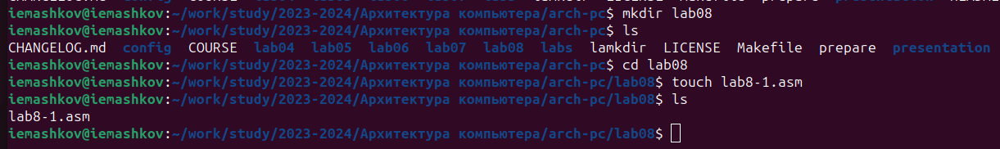{#fig:001 width=70%}

Затем я ввожу код в .asm файл (Рис. [-@fig:002]).

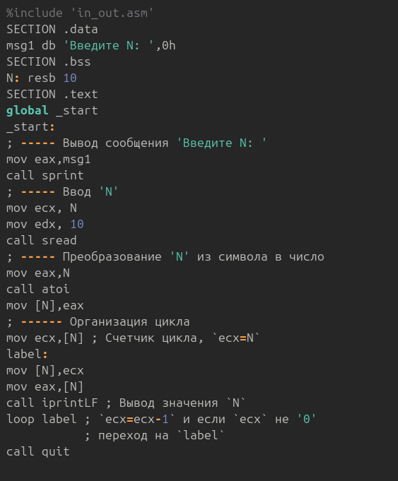{#fig:002 width=70%}

Создаю исполняемый файл и запускаю программу. В выводе программы я получаю 5 переходов от 5-ки и до единицы.(Рис. [-@fig:003]).

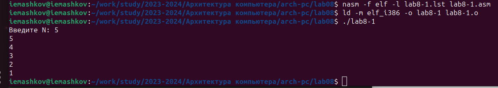{#fig:003 width=70%}

Теперь я меняю кусок программы под меткой **label** (Рис. [-@fig:004]):
```NASM
label:
sub ecx,1 ; `ecx=ecx-1`
mov [N],ecx
mov eax,[N]
call iprintLF
loop label 
```


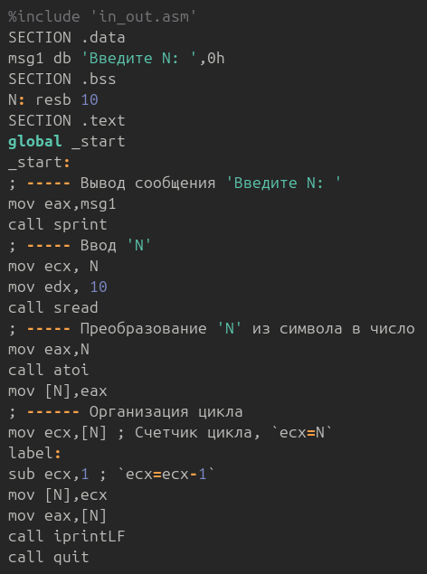{#fig:004 width=70%}

После создания исполняемого файла и его запуска, при введении значения **'N = 5'**, программа начала выпонять цикл от **4 230 000 000** до единицы. Понятное дело, что я не смог дождаться конца работы программы.

После этого я снова меняю код программы (Рис. [-@fig:005]):
```NASM
label:
push ecx ; добавление значения ecx в стек
sub ecx,1
mov [N],ecx
mov eax,[N]
call iprintLF
pop ecx ; извлечение значения ecx из стека
loop label
```

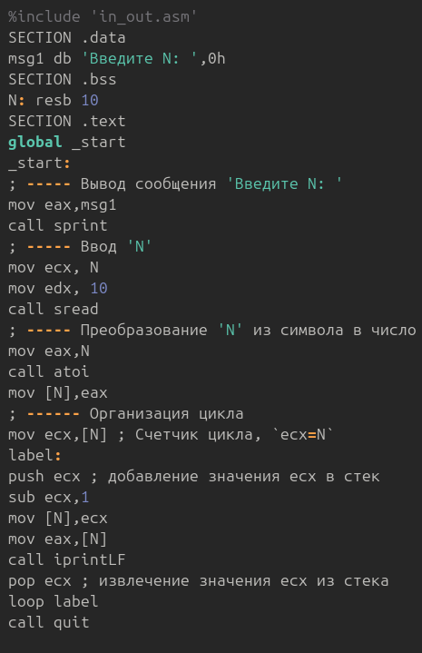{#fig:005 width=70%}

Создаю исполняемый файл и запускаю его (Рис. [-@fig:006]). В выводе получаю пять переходов от 4-ёх до нуля.

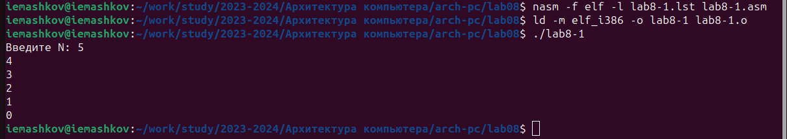{#fig:006 width=70%}

## Обработка аргументов командной строки

Создаю файл **lab8-2.asm** (Рис. [-@fig:007]).

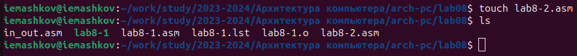{#fig:007 width=70%}

Ввожу код программы (Рис. [-@fig:008]).

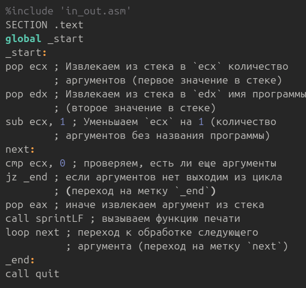{#fig:008 width=70%}

Создаю исполняемый файл и запускаю программу (Рис. [-@fig:009]). В выводе получаю два обработанных аргумента.

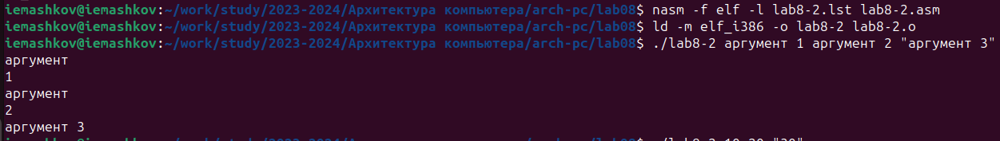{#fig:009 width=70%}

Теперь я убрал кавычки с **аргумент 3** и, в итоге, получил три обработанных аргумента
(Рис. [-@fig:010]).

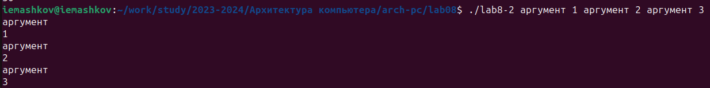{#fig:010 width=70%}

Создаю файл **lab8-3.asm** (Рис. [-@fig:011]).

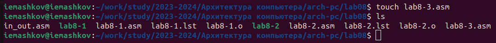{#fig:011 width=70%}

Ввожу в него код программы (Рис. [-@fig:012]).

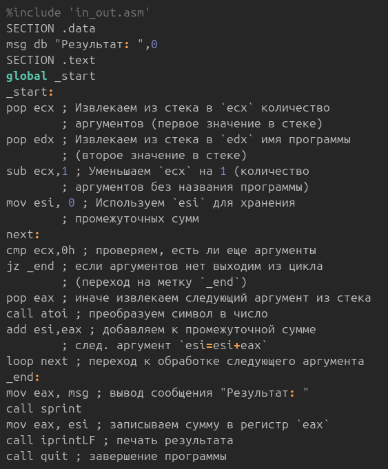{#fig:012 width=70%}

Создаю исполняемый файл и запускаю программу. При введении значений **'12 13 7 10 5'** я получаю их сумму, т.е. **'47'** (Рис. [-@fig:013]).

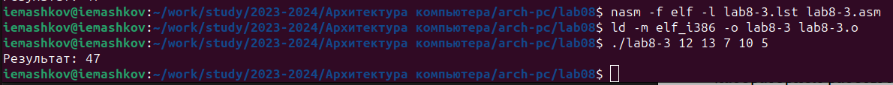{#fig:013 width=70%}

Теперь я меняю код программы так, чтобы она выводила произведение значений, введённых с клавиатуры. Для этого необходимо поменять **'0'** на **'1'** в строчке **'mov esi, 0'**, чтобы в промежуточных произведениях не происходило умножение на **0** (Рис. [-@fig:014]).

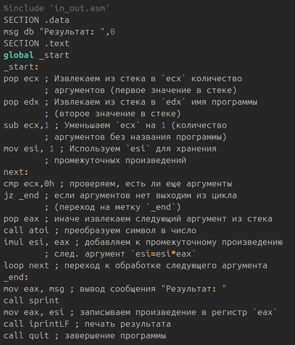{#fig:014 width=70%}

Создаю исполняемый файл и запускаю программу. При введении значений **5 6** я получаю их произведение, т.е. **30** (Рис. [-@fig:015]).

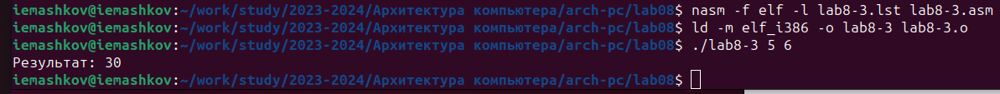{#fig:015 width=70%}

## Выполнение задания для самостоятельной работы

1. Создаю файл **lab8-4.asm** (Рис. [-@fig:016]). Так как код схож с тем, который был в **lab8-3.asm**, я использовал команду **'cp'**, а не **'touch'**.

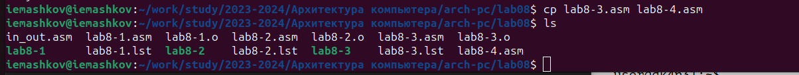{#fig:016 width=70%}

Теперь ввожу код программы, которая будет находить сумму значений функции (Рис. [-@fig:017]). У меня пятый вариант, а это значит, что моя функция равна **'4x + 3'**.

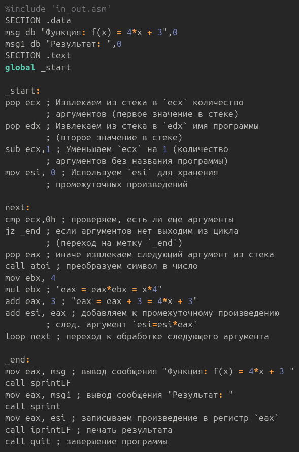{#fig:017 width=70%}

Сам код:
```NASM
%include 'in_out.asm'
SECTION .data
msg db "Функция: f(x) = 4*x + 3",0
msg1 db "Результат: ",0
SECTION .text
global _start

_start:
pop ecx ; Извлекаем из стека в `ecx` количество
        ; аргументов (первое значение в стеке)
pop edx ; Извлекаем из стека в `edx` имя программы
        ; (второе значение в стеке)
sub ecx,1 ; Уменьшаем `ecx` на 1 (количество
        ; аргументов без названия программы)
mov esi, 0 ; Используем `esi` для хранения
        ; промежуточных произведений

next:
cmp ecx,0h ; проверяем, есть ли еще аргументы
jz _end ; если аргументов нет выходим из цикла
        ; (переход на метку `_end`)
pop eax ; иначе извлекаем следующий аргумент из стека
call atoi ; преобразуем символ в число
mov ebx, 4
mul ebx ; "eax = eax*ebx = x*4"
add eax, 3 ; "eax = eax + 3 = 4*x + 3"
add esi, eax ; добавляем к промежуточному произведению
        ; след. аргумент `esi=esi*eax`
loop next ; переход к обработке следующего аргумента

_end:
mov eax, msg ; вывод сообщения "Функция: f(x) = 4*x + 3 "
call sprintLF
mov eax, msg1 ; вывод сообщения "Результат: "
call sprint
mov eax, esi ; записываем произведение в регистр `eax`
call iprintLF ; печать результата
call quit ; завершение программы
```

Теперь я создаю исполняемый файл и запускаю программу (Рис. [-@fig:018]). При введении значений **'1 2 3 4'** я получаю в выводе **'52'**, что и является правильным ответом.

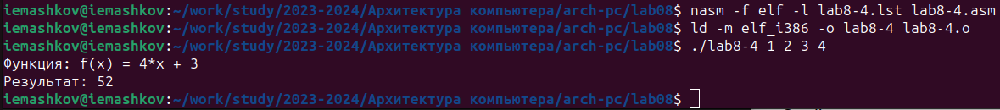{#fig:018 width=70%}

# Выводы

При выполнении данной лабораторной работы я освоил работу с циклами в NASM, а также научился писать программы, которые обрабатывают аргументы командной строки.

# Список литературы

[Архитектура ЭВМ](https://esystem.rudn.ru/pluginfile.php/2089095/mod_resource/content/0/%D0%9B%D0%B0%D0%B1%D0%BE%D1%80%D0%B0%D1%82%D0%BE%D1%80%D0%BD%D0%B0%D1%8F%20%D1%80%D0%B0%D0%B1%D0%BE%D1%82%D0%B0%20%E2%84%968.%20%D0%9F%D1%80%D0%BE%D0%B3%D1%80%D0%B0%D0%BC%D0%BC%D0%B8%D1%80%D0%BE%D0%B2%D0%B0%D0%BD%D0%B8%D0%B5%20%D1%86%D0%B8%D0%BA%D0%BB%D0%B0.%20%D0%9E%D0%B1%D1%80%D0%B0%D0%B1%D0%BE%D1%82%D0%BA%D0%B0%20%D0%B0%D1%80%D0%B3%D1%83%D0%BC%D0%B5%D0%BD%D1%82%D0%BE%D0%B2%20%D0%BA%D0%BE%D0%BC%D0%B0%D0%BD%D0%B4%D0%BD%D0%BE%D0%B9%20%D1%81%D1%82%D1%80%D0%BE%D0%BA%D0%B8..pdf)

