---
## Front matter
title: "Отчёт по лабораторной работе №9"
subtitle: "Дисциплина: Архитектура компьютера"
author: "Машков Илья Евгеньевич"

## Generic otions
lang: ru-RU
toc-title: "Содержание"

## Bibliography
bibliography: bib/cite.bib
csl: pandoc/csl/gost-r-7-0-5-2008-numeric.csl

## Pdf output format
toc: true # Table of contents
toc-depth: 2
lof: true # List of figures
fontsize: 12pt
linestretch: 1.5
papersize: a4
documentclass: scrreprt
## I18n polyglossia
polyglossia-lang:
  name: russian
  options:
	- spelling=modern
	- babelshorthands=true
polyglossia-otherlangs:
  name: english
## I18n babel
babel-lang: russian
babel-otherlangs: english
## Fonts
mainfont: PT Serif
romanfont: PT Serif
sansfont: PT Sans
monofont: PT Mono
mainfontoptions: Ligatures=TeX
romanfontoptions: Ligatures=TeX
sansfontoptions: Ligatures=TeX,Scale=MatchLowercase
monofontoptions: Scale=MatchLowercase,Scale=0.9
## Biblatex
biblatex: true
biblio-style: "gost-numeric"
biblatexoptions:
  - parentracker=true
  - backend=biber
  - hyperref=auto
  - language=auto
  - autolang=other*
  - citestyle=gost-numeric
## Pandoc-crossref LaTeX customization
figureTitle: "Рис."
tableTitle: "Таблица"
listingTitle: "Листинг"
lofTitle: "Список иллюстраций"
lolTitle: "Листинги"
## Misc options
indent: true
header-includes:
  - \usepackage{indentfirst}
  - \usepackage{float} # keep figures where there are in the text
  - \floatplacement{figure}{H} # keep figures where there are in the text
---

# Цель работы

Приобретение навыков написания программ с использованием подпрограмм. Знакомство с методами отладки при помощи GDB и его основными возможностями.

# Задание

1. Реализация подпрограмм в NASM
2. Отладка программ с помощью GDB
3. Выполнение задания для самостоятельной работы


# Выполнение лабораторной работы

## Реализация подпрограмм в NASM

Для начала в папке локального репозитория я создаю директорию **lab09** для дальнейшей работы в ней, а также перехожу в созданный мной каталог и создаю файл **lab9-1.asm** с помощью команды **'touch'**, а также копирую файл **in_out.asm**  (рис. [-@fig:001]).

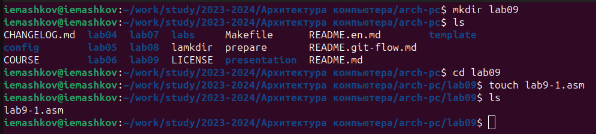{#fig:001 width=70%}

Затем я ввожу код в .asm файл (Рис. [-@fig:002]).

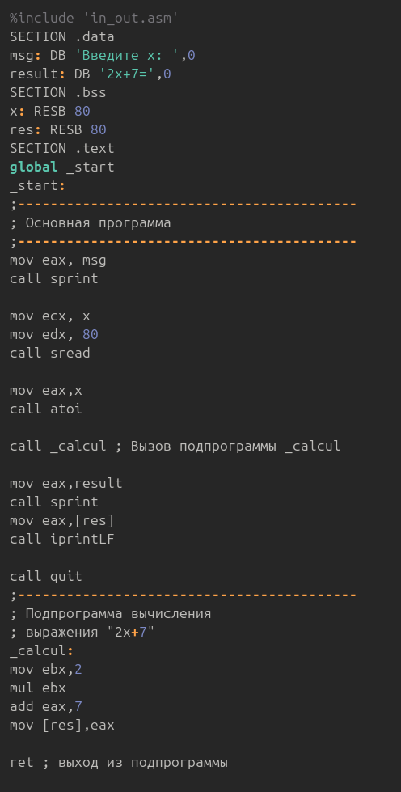{#fig:002 width=70%}

Создаю исполняемый файл и запускаю программу. В выводе программы верное решение уравнения.(Рис. [-@fig:003]).

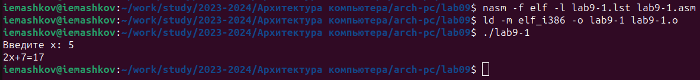{#fig:003 width=70%}

Теперь мне надо было поменять **х** на другое выражение с иксом, а именно на **3𝑥 − 1** . Решение этого выражения надо было реализовать в подпрограмме (Рис. [-@fig:004]):
```NASM
;------------------------------------------
; Подпрограмма вычисления
; выражения "3x-1"
;------------------------------------------
_subcalcul:
mov ebx,3
mul ebx ; EAX = EAX*EBX = 3*x
sub eax,1 ; EAX = EAX - 1 = 3*x - 1

ret ; выход из подпрограммы
```

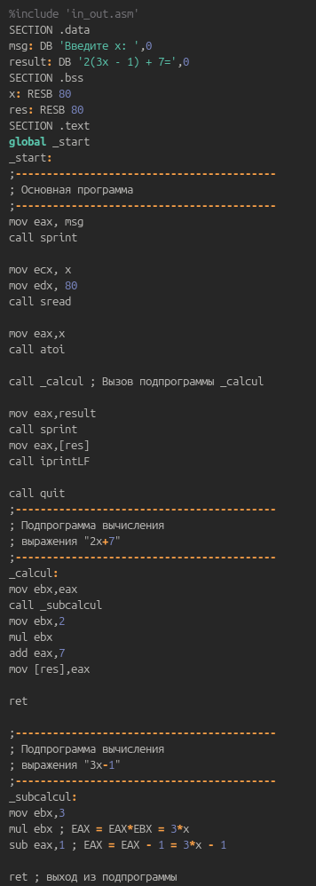{#fig:004 width=70%}

После создания исполняемого файла и его запуска, при введении того же икса, я получаю верное решение уравнения (Рис. [-@fig:005]).

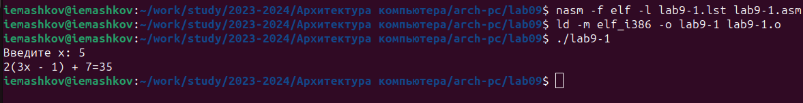{#fig:005 width=70%}

## Отладка программ с помощью GDB

Создаю файл **lab9-2.asm** (Рис. [-@fig:006]).

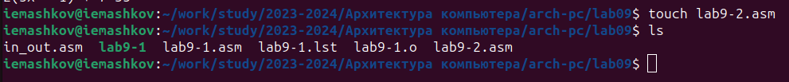{#fig:006 width=70%}

Ввожу код программы для вывода сообщения **Hello, world!**. При трансляции добавляю ключ **-g**, чтобы я мог работать с этой программой в отладчике GDB, а при запуске пишу **gdb lab9-2** чтобы начать работу с программой (Рис. [-@fig:007]). Также я прописываю команду **run** чтобы запустить программу в GDB.

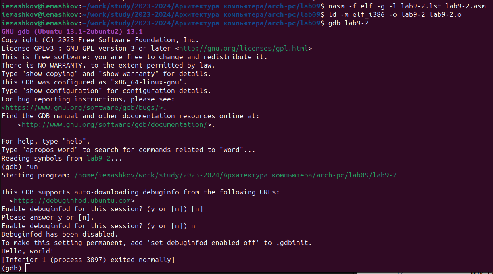{#fig:007 width=70%}

Теперь для более подробного анализа программы я прописываю команду **break _start**, чтобы установить брейкпоинт на метку **_start**. А после этого запускаю программу, её выполнение остановилось на метке **_start**, как и предполагалось (Рис. [-@fig:008]).

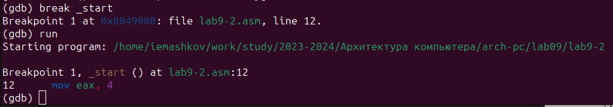{#fig:008 width=70%}

Чтобы посмотреть диссасимилированный код программы я прописываю команду **disassemble _start** (Рис. [-@fig:009]).

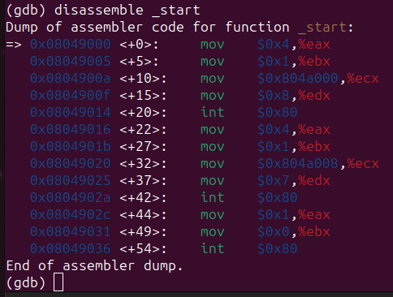{#fig:009 width=70%}

Также можно посмотреть на отображение команд с синтаксисом Intel, для этого я прописываю команду **set disassembly-flavor intel**, а следом команду **disassemble _start** (Рис. [-@fig:010]).

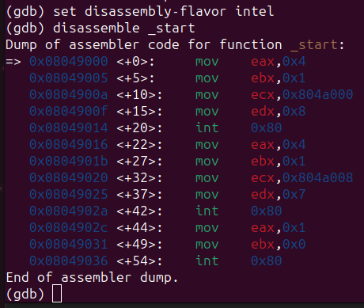{#fig:010 width=70%}

Главное различие в отображении команд в режимах ATT и Intel состоит в том, что в ATT код информации переносимой в тот или иной регистр начинается со знака **'$'** и стоит перед регистром, имя которого начинается со знака **'%'**. Т.е. сначала прописывается источник, а потом приёмник, а не наоборот, как в синтаксисе Intel.

В GDB можно включить режим псевдо графики, чтобы просматривать регистры с их текущими значениями, а также результат диссасимилирования программы. Для этого надо ввести две команды: **'layout asm'** и **'layout regs'** (Рис. [-@fig:011]).

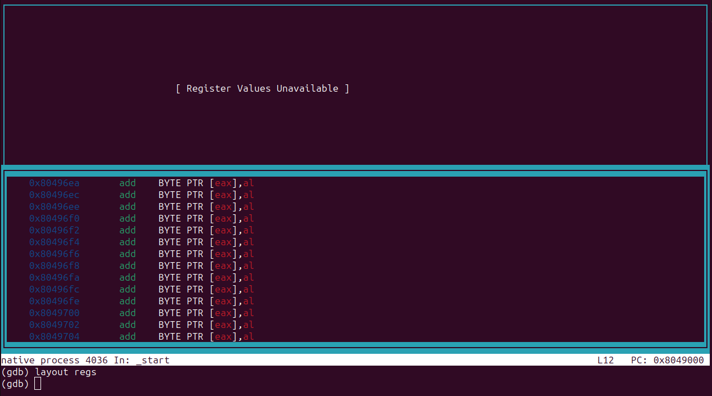{#fig:011 width=70%}

Я уже устанавливал точку останова на метке **_start** с помощью команды **'break <метка>'**. Чтобы посмотреть информацию о всех точках останова нужно использовать команду **'info breakpoints'** или же **'i b'** (Рис. [-@fig:013]).

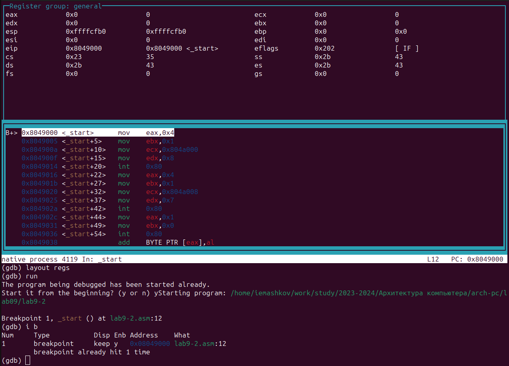{#fig:013 width=70%}

Также можно устанавливать брейкпоинты по адресу инструкции. Это я и собираюсь сделать, для чего прописываю команду **'b *0x8049031'** (Рис. [-@fig:014]). **Важно: перед тем как указать адрес, нужно ввести знак '*'.

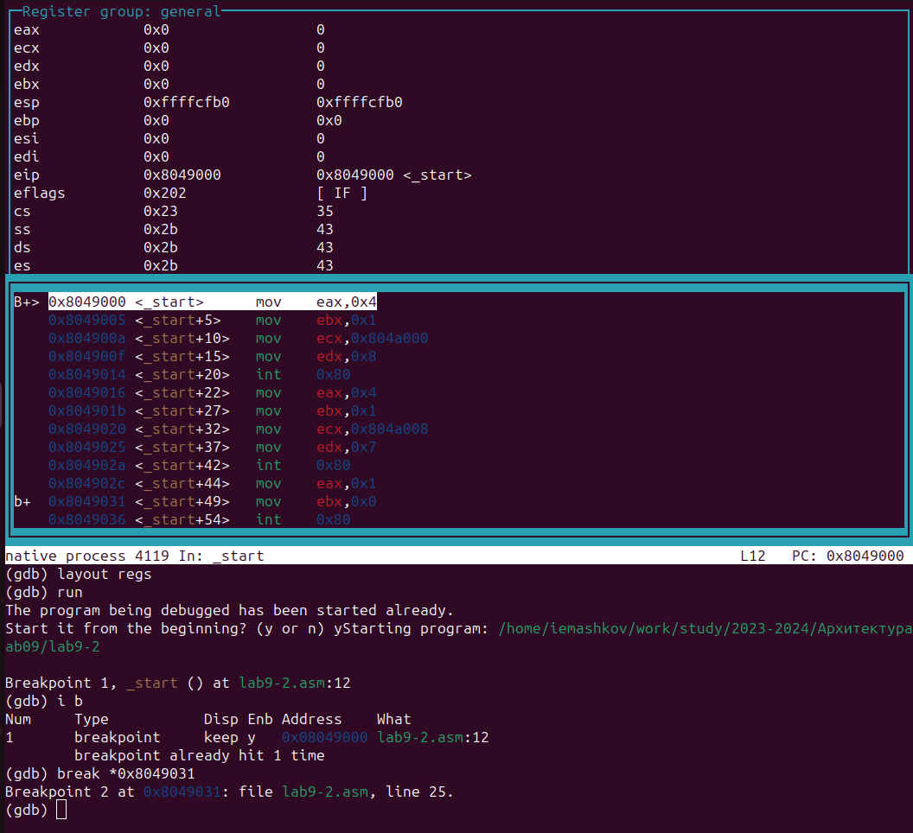{#fig:014 width=70%}

Можно последовательно выполнить n-ое кол-во операций, для этого нужно прописать команду **'stepi <кол-во выполнений>'** (Рис. [-@fig:015]).

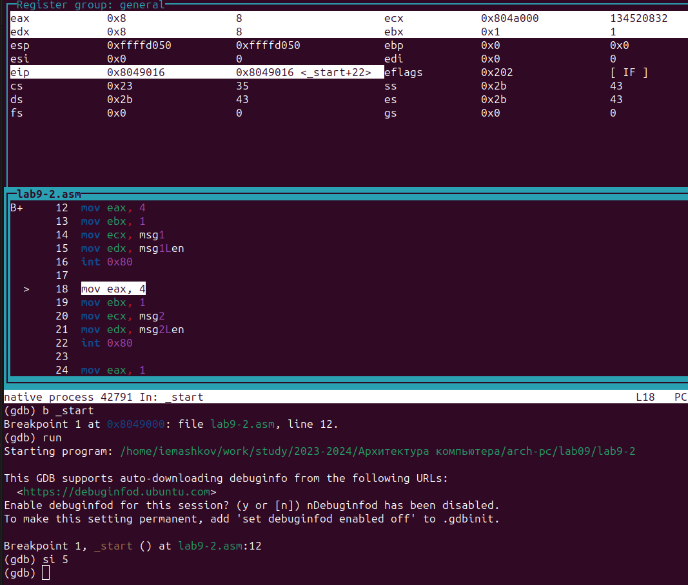{#fig:015 width=70%}

Информация об изменениях в регистре будет в окне регистров при использовании псевдографики, но эту информацию можно получить другим способом: командой **'info registers'** или **'i r'** (Рис. [-@fig:016]).

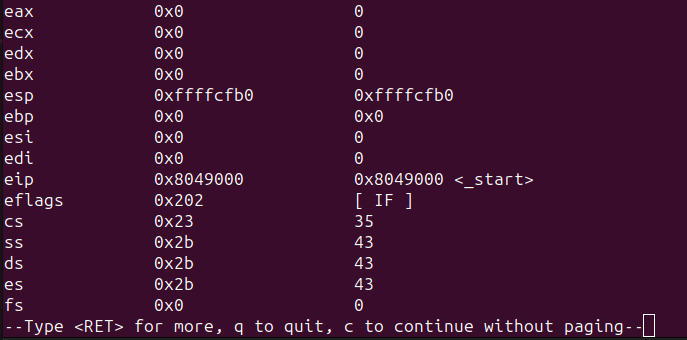{#fig:016 width=70%}

Также с помощью команды **'x/1sb &msg1'** можно посмотреть значение переменной (Рис. [-@fig:017]).

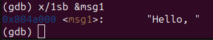{#fig:017 width=70%}

Можно сделать то же самое, указав адрес нужной нам переменной (Рис. [-@fig:018]). 

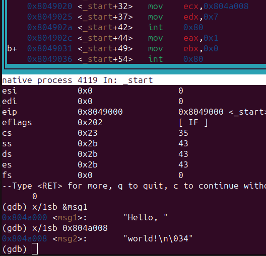{#fig:018 width=70%}

C помощью команды **'set {char}&msg1='h''**, я меняю значение для переменной **msg1** (Рис. [-@fig:019]).

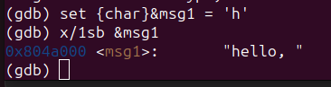{#fig:019 width=70%}

Делаю это и для **msg2** (Рис. [-@fig:020]).

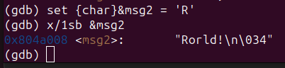{#fig:020 width=70%}

Чтобы посмотреть значение регистра **edx** в разных форматах необходимо прописать команды: **'p/t $edx'** (двоичный формат), **'p/s $edx'** (шестнадцатеричный формат) и **'p/x $edx'** (символьный формат) (Рис. [-@fig:021]).

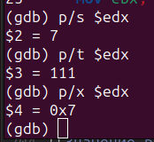{#fig:021 width=70%}

Теперь с помощью команды **'set'** меняю значение регистра **ebx** (Рис. [-@fig:022]) (Рис. [-@fig:023]).

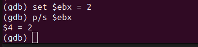{#fig:022 width=70%}

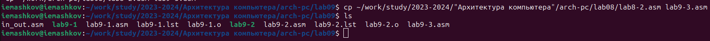{#fig:023 width=70%}

Разница этих двух команд заключается в том, что при указании двойки в кавычках, мы присваиваем регистру **ebx** код символа '2' из системы ASCII, а без кавычек мы присваиваем значение 2.

Копирую содержимое файла **'lab8-2.asm'** в **'lab9-3.asm'** (Рис. [-@fig:024]).

{#fig:024 width=70%}

Создаю исполняемый файл и запускаю его в GDB вместе с аргументами, для учёиа которых необходимо прописать ключ **'--args'** (Рис. [-@fig:025]).

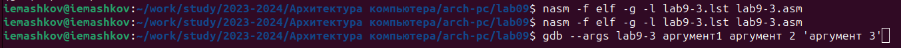{#fig:025 width=70%}

Ставлю точку останова на метке **_start** (Рис. [-@fig:026]).

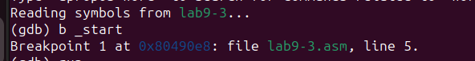{#fig:026 width=70%}

Запуск программы в отладчике GDB (Рис. [-@fig:027]).

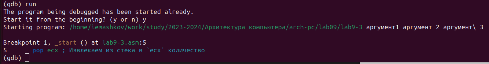{#fig:027 width=70%}

Теперь можно посмотреть содержимое регистра **esp** (Рис. [-@fig:028]). 

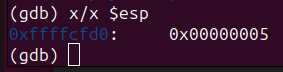{#fig:028 width=70%}

Как видно, число аргументов равно **5** - это имя программы **lab9-3** и непосредственно аргументы: **аргумент1, аргумент, 2 и 'аргумент 3'**.

Теперь смотрю остальные позиции стека по адресам: **[esp+4], [esp+8], [esp+12], [esp+16], [esp+20] и [esp+24]** (Рис. [-@fig:029]).

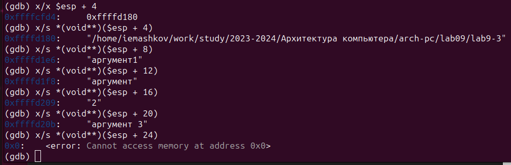{#fig:029 width=70%}

Как видно из скриншота в каждой позиции, кроме **[esp+24]**, есть какая-либо информация.

Шаг **+4** используется, потому что при шаге **+1 и +2** мы обнаружим отсутствие какого либо содержимого. А при шаге **+3** мы будем натыкаться на знак отступа перед аргументом (Рис. [-@fig:030]).

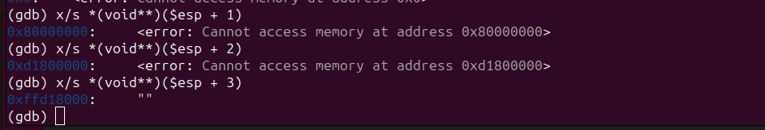{#fig:030 width=70%}

## Выполнение задания для самостоятельной работы

1. Создаю файл **lab9-4.asm** (Рис. [-@fig:031]). Так как код строится на базе того, который был в **lab8-4.asm**, я использовал команду **'cp'**, а не **'touch'**.

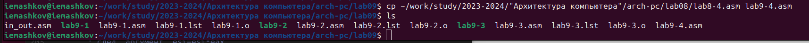{#fig:031 width=70%}

Теперь меняю код программы так, чтобы вычисление функции проводилось в подпрограмме (Рис. [-@fig:032]). 

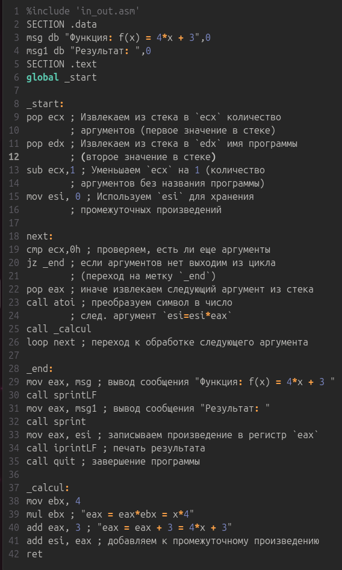{#fig:032 width=70%}

Сам код:
```NASM
%include 'in_out.asm'
SECTION .data
msg db "Функция: f(x) = 4*x + 3",0
msg1 db "Результат: ",0
SECTION .text
global _start

_start:
pop ecx ; Извлекаем из стека в `ecx` количество
        ; аргументов (первое значение в стеке)
pop edx ; Извлекаем из стека в `edx` имя программы
        ; (второе значение в стеке)
sub ecx,1 ; Уменьшаем `ecx` на 1 (количество
        ; аргументов без названия программы)
mov esi, 0 ; Используем `esi` для хранения
        ; промежуточных произведений

next:
cmp ecx,0h ; проверяем, есть ли еще аргументы
jz _end ; если аргументов нет выходим из цикла
        ; (переход на метку `_end`)
pop eax ; иначе извлекаем следующий аргумент из стека
call atoi ; преобразуем символ в число
        ; след. аргумент `esi=esi*eax`
call _calcul
loop next ; переход к обработке следующего аргумента

_end:
mov eax, msg ; вывод сообщения "Функция: f(x) = 4*x + 3 "
call sprintLF
mov eax, msg1 ; вывод сообщения "Результат: "
call sprint
mov eax, esi ; записываем произведение в регистр `eax`
call iprintLF ; печать результата
call quit ; завершение программы

_calcul:
mov ebx, 4
mul ebx ; "eax = eax*ebx = x*4"
add eax, 3 ; "eax = eax + 3 = 4*x + 3"
add esi, eax ; добавляем к промежуточному произведению
ret
```

Теперь я создаю исполняемый файл и запускаю программу (Рис. [-@fig:033]). При введении значений **'1 2 3 4'** я получаю в выводе **'52'**, что и является правильным ответом.

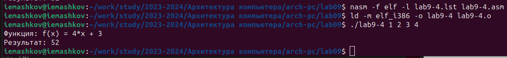{#fig:033 width=70%}

2. Создаю файл **lab9-5.asm** (Рис. [-@fig:034]).

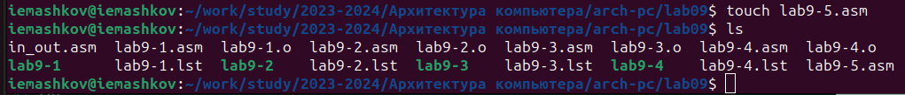{#fig:034 width=70%}

Ввожу в него код из листинга 9.3:

```NASM
%include 'in_out.asm'
SECTION .data
div: DB 'Результат: ',0
SECTION .text
GLOBAL _start
_start:
; ---- Вычисление выражения (3+2)*4+5
mov ebx,3
mov eax,2
add ebx,eax
mov ecx,4
mul ecx
add ebx,5
mov edi,ebx
; ---- Вывод результата на экран
mov eax,div
call sprint
mov eax,edi
call iprintLF
call quit
```
Теперь я создаю исполняемый файл и запускаю программу (Рис. [-@fig:035]). В выводе получаю **10**, а должно было получится **25**.

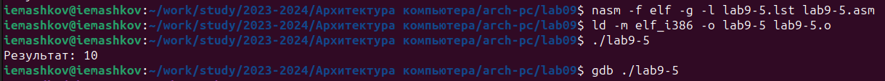{#fig:035 width=70%}

Запускаю эту программу в отладчике GDB и устанавливаю брейкпоинт на метке **_start** (Рис. [-@fig:036]).

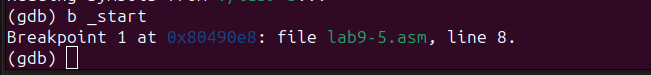{#fig:035 width=70%}

Затем запускаю режим псевдографики (Рис. [-@fig:037]).

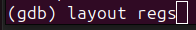{#fig:037 width=70%}

Теперь последовательно ввожу команду **'stepi'**, чтобы видеть изменения в ключевых регистрах (Рис. [-@fig:038]).

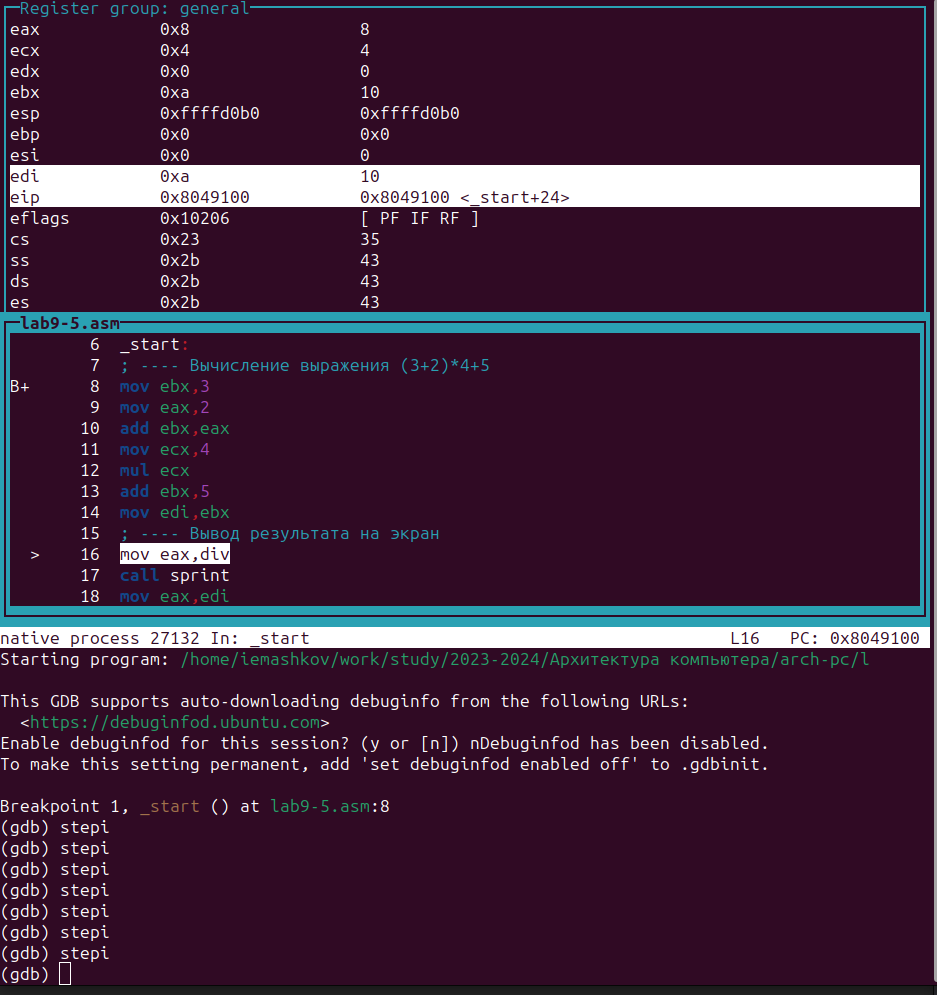{#fig:038 width=70%}

Как я заметил, значение регистра **ecx** умножается не на значение **ebx** после сложения, а на начальное значение **eax**. Потом же к сумме полученной в **ebx** прибавляется **5** и результат записывается в переменную для вывода.

Исправляю код так, чтобы он работал правильно (Рис. [-@fig:039]).

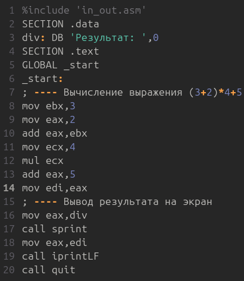{#fig:039 width=70%}

Сам код:

```NASM
%include 'in_out.asm'
SECTION .data
div: DB 'Результат: ',0
SECTION .text
GLOBAL _start
_start:
; ---- Вычисление выражения (3+2)*4+5
mov ebx,3
mov eax,2
add eax,ebx
mov ecx,4
mul ecx
add eax,5
mov edi,eax
; ---- Вывод результата на экран
mov eax,div
call sprint
mov eax,edi
call iprintLF
call quit
```

Снова создаю исполняемый файл и запускаю программу и получаю правильный ответ (Рис. [-@fig:040]).

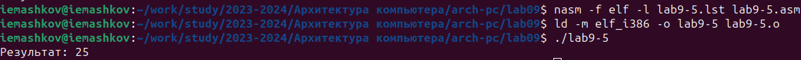{#fig:040 width=70%}

# Выводы

При выполнении данной лабораторной работы я научился писать программы с использованием подпрограмм, а также познакомился с отладчиком GDB (хороший парень, на самом деле) и освоил его возможности.

# Список литературы

[Архитектура ЭВМ](https://esystem.rudn.ru/pluginfile.php/2089096/mod_resource/content/0/%D0%9B%D0%B0%D0%B1%D0%BE%D1%80%D0%B0%D1%82%D0%BE%D1%80%D0%BD%D0%B0%D1%8F%20%D1%80%D0%B0%D0%B1%D0%BE%D1%82%D0%B0%20%E2%84%969.%20%D0%9F%D0%BE%D0%BD%D1%8F%D1%82%D0%B8%D0%B5%20%D0%BF%D0%BE%D0%B4%D0%BF%D1%80%D0%BE%D0%B3%D1%80%D0%B0%D0%BC%D0%BC%D1%8B.%20%D0%9E%D1%82%D0%BB%D0%B0%D0%B4%D1%87%D0%B8%D0%BA%20..pdf)

