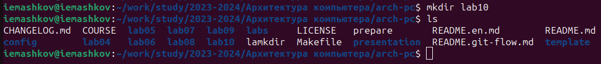
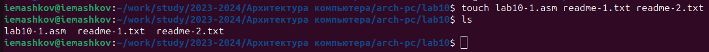
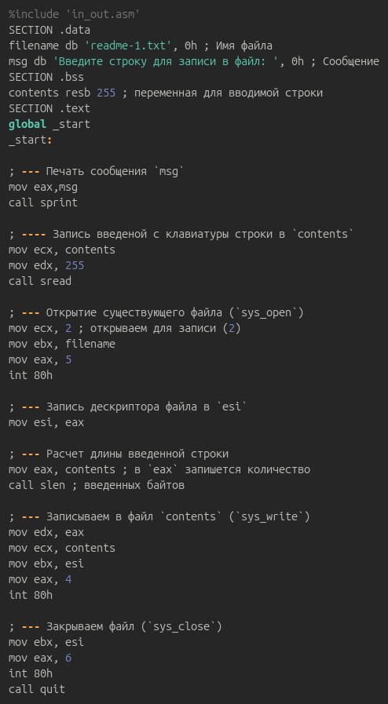
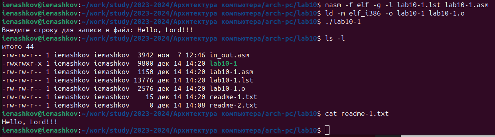
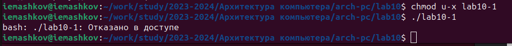
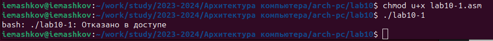
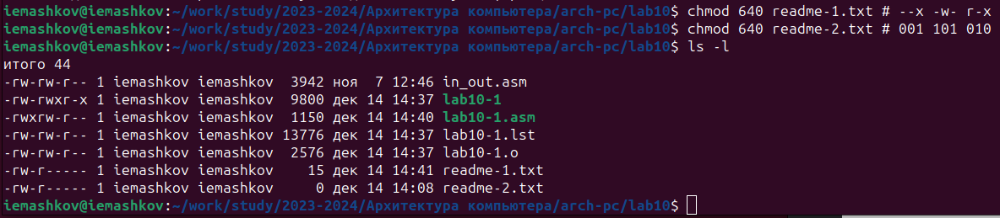
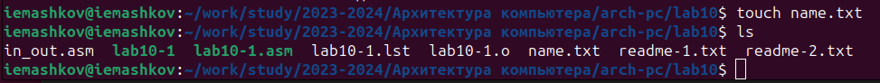
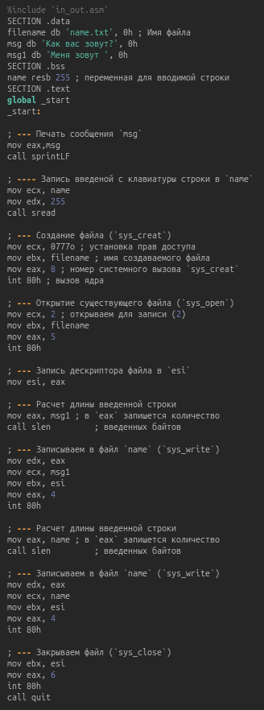
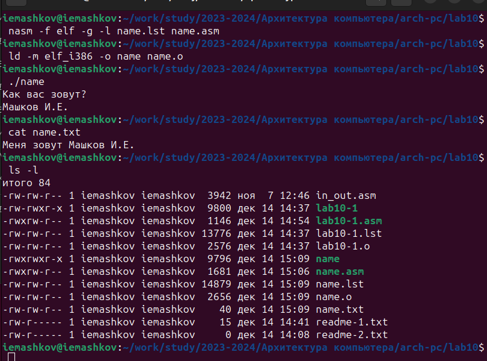

---
## Front matter
title: "Отчёт по лабораторной работе №10"
subtitle: "Дисциплина: Архитектура компьютеров"
author: "Машков Илья Евгеньевич"

## Generic otions
lang: ru-RU
toc-title: "Содержание"

## Bibliography
bibliography: bib/cite.bib
csl: pandoc/csl/gost-r-7-0-5-2008-numeric.csl

## Pdf output format
toc: true # Table of contents
toc-depth: 2
lof: true # List of figures
fontsize: 12pt
linestretch: 1.5
papersize: a4
documentclass: scrreprt
## I18n polyglossia
polyglossia-lang:
  name: russian
  options:
	- spelling=modern
	- babelshorthands=true
polyglossia-otherlangs:
  name: english
## I18n babel
babel-lang: russian
babel-otherlangs: english
## Fonts
mainfont: PT Serif
romanfont: PT Serif
sansfont: PT Sans
monofont: PT Mono
mainfontoptions: Ligatures=TeX
romanfontoptions: Ligatures=TeX
sansfontoptions: Ligatures=TeX,Scale=MatchLowercase
monofontoptions: Scale=MatchLowercase,Scale=0.9
## Biblatex
biblatex: true
biblio-style: "gost-numeric"
biblatexoptions:
  - parentracker=true
  - backend=biber
  - hyperref=auto
  - language=auto
  - autolang=other*
  - citestyle=gost-numeric
## Pandoc-crossref LaTeX customization
figureTitle: "Рис."
tableTitle: "Таблица"
listingTitle: "Листинг"
lofTitle: "Список иллюстраций"
lolTitle: "Листинги"
## Misc options
indent: true
header-includes:
  - \usepackage{indentfirst}
  - \usepackage{float} # keep figures where there are in the text
  - \floatplacement{figure}{H} # keep figures where there are in the text
---

# Цель работы

Приобретение навыков написания программ с использованием циклов и обработкой аргументов командной строки.

# Задание

1. Выполнение заданий лабораторной работы
2. Выполнение задания для самостоятельной работы


# Выполнение лабораторной работы

## Выполнение заданий лабораторной работы

1. Для начала в папке локального репозитория я создаю директорию **lab10** для дальнейшей работы в ней (рис. [-@fig:001]).

{#fig:001 width=70%}

Теперь перехожу в созданный мной каталог и создаю файлы **lab10-1.asm**, **readme-1.txt**, **readme-2.txt** с помощью команды **'touch'**, а также копирую файл **in_out.asm** (Рис. [-@fig:002]).

{#fig:002 width=70%}

2. Теперь ввожу код программы в .asm файл (Рис. [-@fig:003]).

{#fig:003 width=70%}

Создаю и запускаю исполняемый файл (Рис. [-@fig:004]).

{#fig:004 width=70%}

3. С помощью команды **'chmod'** запрещаю выполнение файла **lab10-1**, изменив права доступа к нему (Рис. [-@fig:005]):

{#fig:005 width=70%}

Происходит отказ в доступе, т.к. я сам же запретил его выполнение с помощью ключей **'u'** (права владельца), **'-'** (исключение прав), **'x'** (права на исполнение файла).

4. С помощью команды **'chmod'** добавляю права на выполнение файла **lab10-1.asm**, изменив права доступа к нему (Рис. [-@fig:006]). 

{#fig:006 width=70%}

Снова получаю отказ в доступе, т.к. я добавил права доступа к .asm файлу, а не к исполняемому.

5. В соответствии с 5-ым вариантом предоставляю права доступа к файлам **readme-1.txt** и **readme-2.txt** в текстовом и двоичном виде и проверяю это с помощью команды **'ls'** с ключом **'-l'** (Рис. [-@fig:007]).

{#fig:007 width=70%}

## Выполнение задания для самостоятельной работы

1. Создаю файл **name.asm** (создание этого файла я забыл заскринить) и **name.txt** (Рис. [-@fig:008]).

{#fig:008 width=70%}

Теперь ввожу код программы, которая будет запрашивать моё имя и дописывать к строке **"Меня зовут "** информацию введённую с клавиатуры (Рис. [-@fig:009]).

{#fig:009 width=70%}

Сам код:
```NASM
%include 'in_out.asm'
SECTION .data
filename db 'name.txt', 0h ; Имя файла
msg db 'Как вас зовут?', 0h
msg1 db 'Меня зовут ', 0h
SECTION .bss
name resb 255 ; переменная для вводимой строки
SECTION .text
global _start
_start:

; --- Печать сообщения `msg`
mov eax,msg
call sprintLF

; ---- Запись введеной с клавиатуры строки в `name`
mov ecx, name
mov edx, 255
call sread

; --- Создание файла (`sys_creat`)
mov ecx, 0777o ; установка прав доступа
mov ebx, filename ; имя создаваемого файла
mov eax, 8 ; номер системного вызова `sys_creat`
int 80h ; вызов ядра

; --- Открытие существующего файла (`sys_open`)
mov ecx, 2 ; открываем для записи (2)
mov ebx, filename
mov eax, 5
int 80h

; --- Запись дескриптора файла в `esi`
mov esi, eax

; --- Расчет длины введенной строки
mov eax, msg1 ; в `eax` запишется количество
call slen         ; введенных байтов

; --- Записываем в файл `name` (`sys_write`)
mov edx, eax
mov ecx, msg1
mov ebx, esi
mov eax, 4
int 80h

; --- Расчет длины введенной строки
mov eax, name ; в `eax` запишется количество
call slen         ; введенных байтов

; --- Записываем в файл `name` (`sys_write`)
mov edx, eax
mov ecx, name
mov ebx, esi
mov eax, 4
int 80h

; --- Закрываем файл (`sys_close`)
mov ebx, esi
mov eax, 6
int 80h
call quit
```

Теперь я создаю исполняемый файл и запускаю программу, а также провожу проверку её работы с помощью команд **'cat'** и **'ls -l'** (Рис. [-@fig:010]).

{#fig:010 width=70%}

# Выводы

При выполнении данной лабораторной работы я освоил работу с правами доступа к файлам, а также научился писать программы для работы с файлами.

# Список литературы

[Архитектура ЭВМ](https://esystem.rudn.ru/pluginfile.php/2089097/mod_resource/content/0/%D0%9B%D0%B0%D0%B1%D0%BE%D1%80%D0%B0%D1%82%D0%BE%D1%80%D0%BD%D0%B0%D1%8F%20%D1%80%D0%B0%D0%B1%D0%BE%D1%82%D0%B0%20%E2%84%9610.%20%D0%A0%D0%B0%D0%B1%D0%BE%D1%82%D0%B0%20%D1%81%20%D1%84%D0%B0%D0%B9%D0%BB%D0%B0%D0%BC%D0%B8%20%D1%81%D1%80%D0%B5%D0%B4%D1%81%D1%82%D0%B2%D0%B0%D0%BC%D0%B8%20Nasm.pdf)

